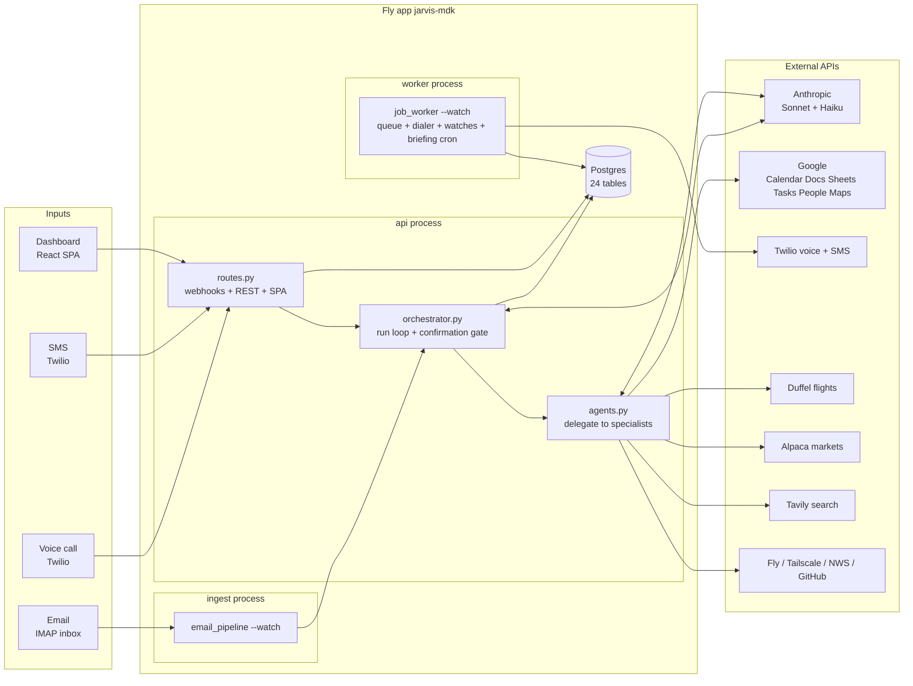
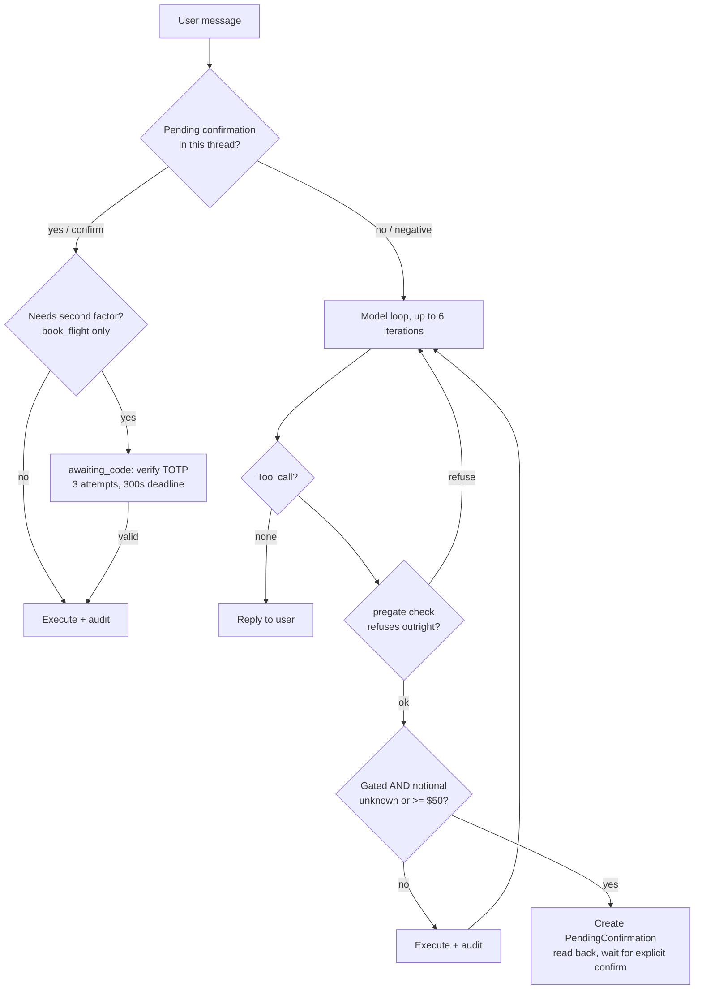
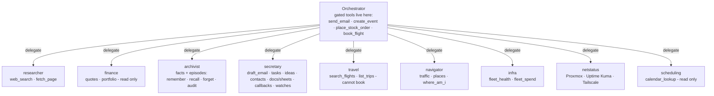

# JARVIS — Architecture

> **This is a living document.** Any PR that changes system structure — a new tool, agent,
> table, channel, job kind, or gate rule — must update the relevant section and diagram here.
> That rule is enforced by `CLAUDE.md` at the repo root, so Claude Code sessions maintain it
> automatically. Last full audit: 2026-07-17.

JARVIS is a personal assistant reachable by **voice call, SMS, email, and a web dashboard**.
One FastAPI app + React SPA, one Postgres database, deployed as a single Fly.io app
(`jarvis-mdk`) running three processes. All intelligence flows through one orchestrator
loop (Claude Sonnet) that delegates to specialist sub-agents and keeps every irreversible
action behind a confirmation gate.

---

## 1. System at a glance



Every channel funnels into the same entrypoint:
`orchestrator.run(db, channel, thread_key, user_text, actor, subject)`.

---

## 2. Deployment & CI

| Piece | Detail |
|---|---|
| Fly app | `jarvis-mdk`, region `sjc`, one shared-cpu 512 MB VM running all three processes |
| `api` | `uvicorn app.main:app` — webhooks, REST API, SPA, voice background tasks |
| `ingest` | `python -m app.channels.email_pipeline --watch` — IMAP poll every 120 s |
| `worker` | `python -m app.workers.job_worker --watch` — job queue, outbound dialer, watch engine, briefing scheduler |
| Migrations | `release_command = "alembic upgrade head"` (12 migrations, `0001`–`0012`) |
| CI (`.github/workflows/fly-deploy.yml`) | PRs → pytest only. Push to `main` → pytest, then `flyctl deploy --remote-only`. Docs-only pushes (`docs/**`, `**.md`) skip both. |
| Image | Two-stage Dockerfile: Node 20 builds the Vite SPA into `/static`, Python 3.11 runs the backend and serves it |

---

## 3. Channels and their trust model

Auth is per-channel and deliberately unequal — the security spine of the system:

| Channel | Entry | Auth | Strength |
|---|---|---|---|
| Dashboard | `POST /api/chat` etc. | JWT (bcrypt login) | strong |
| Email | `ingest` IMAP poll | sender whitelist (`ALLOWED_SENDERS` + `contacts_whitelist`) | strong |
| SMS | `POST /api/sms/inbound` | Twilio signature + number whitelist | strong |
| **Voice** | `POST /api/voice/*` | Twilio signature + **caller-ID whitelist** | **weak — spoofable** |
| Location ping | `POST /api/location` | shared secret header, constant-time compare (the optional `nonce` is a correlator, never a credential) | strong |
| Outbound calls | worker dialer | hard `ALLOWED_NUMBERS` check at schedule **and** dial time | can only ring the owner |

Because caller-ID is spoofable, voice runs restricted allowlists (`VOICE_TOOLS_PHASE1`,
`VOICE_AGENTS_PHASE1` in `channels/voice_pipeline.py`): `place_stock_order` is unreachable,
and `book_flight` is allowed *only* because its TOTP second factor is the one control a
spoofed caller cannot beat.

Channel quirks that matter:

- **Voice** cannot orchestrate inline (Twilio webhook timeout ~15 s vs up to 6 model
  round-trips), so `/voice/gather` returns TwiML immediately, runs the turn as a background
  task parked in `voice_turns`, and `/voice/poll` collects it. `thread_key` is the
  **CallSid** — a call is a bounded session, so a stale "yes" from a previous call can never
  resolve a new confirmation. Replies pass through `_speakable()` which strips URLs before
  text-to-speech. Each completed call emails the owner a transcript and enqueues episodic
  distillation.
- **Slow turns can be held.** When a turn outruns the poll budget (~40 s), she offers to
  hold the line or hand off. Saying "wait" enters `/voice/hold` — a listen-free loop that
  plays hold music (`voice_hold_music_url`) or brief reassurance and re-checks the *same*
  running turn, so a silent waiting caller is never looped with "Still there?". The answer
  is spoken the moment it's ready; after `voice_hold_max_seconds` (default 300) she hands
  off, and the finished answer is emailed via the `notify_email` flag on the turn row.
- **Email** has one deliberate hole: airline confirmation emails from non-whitelisted
  senders are never orchestrated, but *are* parsed into the `trips` table
  (`travel.record_trip_from_email`).
- **SMS** replies also mirror to the owner's email when `sms_email_copy` is on.

---

## 4. The orchestrator and the confirmation gate

`orchestrator.run()` is the only place tools execute with a gate. The loop: resolve any
pending confirmation first; otherwise build the system preamble (Tier-1 ground truth +
relevant memories + instructions, plus voice instructions on calls) and run up to
`_MAX_ITERS = 6` Anthropic round-trips, executing tools between them.



**What is gated** (registered top-level only, in `handlers/base.py::build_registry`):

| Tool | Gate behavior |
|---|---|
| `send_email` | always confirms — mail in the owner's name is irreversible |
| `create_event` | confirms **only with attendees** (an invite emails people); solo events run immediately |
| `place_stock_order` | notional threshold ($50); also hard-disabled unless `ENABLE_TRADING` |
| `book_flight` | confirm **+ TOTP code** + pregate (offer must come from this thread's own search, ≤ `max_booking_usd`) |
| `create_project_from_idea` | confirm + pregate (idea exists, not already promoted, GitHub configured, name given) — creates a new GitHub repo from a captured idea |

Everything else executes immediately — the prompt explicitly forbids preemptive
"shall I?" asking for ungated actions.

**Structural safety, not convention:** the gate exists only in `run()`. Sub-agents
(`agents.run_agent`) call the registry directly, so they *refuse* any gated or unknown tool
outright. A misconfigured agent roster fails closed. Voice confirmation vocabulary is
narrowed — "ok"/"yeah" never trigger a gated action; "confirm"/"affirmative"/"execute" do.

**Confirmation hygiene & batching.** A pending confirmation expires after
`pending_confirmation_ttl_seconds` (a stale "yes" can't fire an hours-old action), and only a
*bare* affirmative confirms — "yes, and also do X" is a new request, not a confirmation.

A compound "do this, that, and the other" is handled in one turn in **two passes**: pass 1
executes every ungated action (tasks, docs, sheets) and any outright refusals; pass 2 buffers
the gated ones. So no-confirmation deliverables are always completed — and their results in
hand — before any gated action is queued (tool results are still returned in the model's
original order, matched by id). The gated actions raised in that turn share a `batch_id`, so
they read back as one numbered set and a single "confirm" runs them all in creation order with
one combined summary (or "cancel" drops them all). `book_flight`'s TOTP second factor is never
batched — it keeps its own flow. Cross-turn ordering (the model issuing all ungated tool calls
in the same turn) is prompt-directed, not code-enforced. See
`docs/TDD-multi-action-buffering.md`.

---

## 5. Agents

The roster is **data-driven**: `AgentConfig` rows (editable live in the Admin UI) seeded
from `agents.DEFAULT_AGENTS`. `delegate` is the only route from the orchestrator to a
specialist; sub-agent registries never contain `delegate` (no recursion) or gated tools.



Sub-agents run a bounded tool loop (`run_agent`, `_MAX_ITERS` iterations). If an agent
spends its whole budget still calling tools without writing an answer, `run_agent` forces
one final no-tools synthesis pass from the evidence gathered — so a research turn always
returns a real answer, never an empty `(no result)` that surfaces as "the agent failed".
Sub-agents with date-sensitive tools get real "now" injected and stale-date flagging on
their output. Every sub-agent tool call is audited as `agent:tool` in `actions_audit`.

**Audit status is outcome-derived, not assumed.** Tool execution runs through the single
seam `Registry.run_tool()`, which returns `(result, status)`: a handler that raises
`ToolFault` (or any exception) — e.g. a Calendar 401, a Duffel key rejection, an
unreachable Tavily — is recorded as `status="error"`, a healthy call as `ok`. Handlers
raise `ToolFault` (message preserved verbatim, so the user still sees the guidance)
*instead of* returning a hand-worded error string; the registry catches it so a failure
still never crashes the loop. Gate decisions are written literally, not derived:
`confirmed` (the user approved) and `refused` (a sub-agent hit the top-level-only gate, or
a pre-gate refusal) both stay in the ok-family — a refused booking is a healthy system.
This makes `actions_audit` a truthful substrate that credential/liveness health checks can
read to tell a real failure from silence.

The division of labor is intentional: specialists **prepare** (draft, search, look up),
the orchestrator **commits** (send, book, create with invites) — under the gate.

---

## 6. Tool inventory

~45 tools across `backend/app/handlers/`. Gated tools in **bold**.

| Domain | Tools | External API |
|---|---|---|
| Email | draft_email, **send_email** | Gmail SMTP |
| Calendar | calendar_lookup, **create_event** | Google Calendar |
| Tasks | add_task, list_tasks, complete_task, cancel_task | DB → Google Tasks push |
| Docs/Sheets | create_google_doc, create_google_sheet, append_to_google_doc | Google Docs/Sheets |
| Memory | remember_fact, recall_facts, forget_fact, audit_memory, recall_episodes, recall, forget_episode | pgvector / Voyage embeddings |
| Research | web_search, fetch_page | Tavily |
| Finance | get_stock_price, get_portfolio, **place_stock_order** | Alpaca |
| Travel | search_flights, list_trips, **book_flight** | Duffel |
| Navigation | get_traffic, find_place, where_am_i | Google Maps, `location_pings` |
| Contacts | whoami, lookup_contact, save_contact, list_contacts, sync_google_contacts, google_status | Google People |
| Ideas | capture_idea, list_ideas, get_idea, **create_project_from_idea** (gated) | GitHub Contents API + `POST /user/repos` |
| Callbacks | call_me_back, pending_callbacks, cancel_callback | Twilio (via worker) |
| Watches | watch_for, list_watches, cancel_watch | LLM judge (worker) |
| Infra | fleet_health, fleet_spend | Fly Machines + GraphQL |
| Homelab | get_node_status, get_service_health (stubbed), tailscale_status | Tailscale |
| Time | get_current_datetime | system clock + timezonefinder |

Injection defenses: web content is fenced as UNTRUSTED before the model sees it; docs
written from web-fenced content get a provenance footer; `book_flight` and
`append_to_google_doc` require an ownership row (`flight_offers` / `google_documents`)
created by JARVIS herself — an ID the model invents or was told about simply doesn't book.

**Ideas → projects.** A captured idea (`capture_idea`, committed to the fixed `jarvis-ideas`
repo) can be read back in full (`get_idea`) and promoted into a brand-new GitHub repo:
`create_project_from_idea` (gated) creates the repo via `POST /user/repos`, seeds a README +
the idea, and records `Idea.promoted_url`. The orchestrator asks for the repo name if the user
didn't give one; the gate confirms before anything is created. See
`docs/TDD-idea-to-project.md`.

---

## 7. Memory — three tiers

```mermaid
flowchart LR
    subgraph Tier 1 — authoritative
        T1[OWNER_* settings + persona_profile + preferences<br/>injected into EVERY system prompt as ground truth]
    end
    subgraph Tier 2 — learned facts
        T2[memories table + embeddings<br/>written by remember_fact or the reflector]
    end
    subgraph Tier 3 — episodic
        T3[episodes + episode_quotes<br/>distilled from whole conversations]
    end
    TURN[Every turn] -- reflect job<br/>Haiku extracts facts, dedup 0.92 --> T2
    CALL[Call completes] -- distill_episode job<br/>Haiku summarizes, quotes must be verbatim --> T3
    T1 --> PROMPT[System preamble]
    T2 -- semantic recall --> PROMPT
    T3 -- recall_episodes tool --> PROMPT
```

- **Tier 1** can never be overwritten by inference — the reflector prompt hard-guards
  against re-learning configured facts.
- **Tier 2** recall is semantic: pgvector on Postgres, in-Python cosine fallback elsewhere.
  Wrong beliefs are correctable (`forget_fact`) and auditable (`audit_memory` emails a
  stated-vs-inferred report).
- **Tier 3** distillation has a faithfulness gate: a quote is stored only if it is a
  verbatim, speaker-matched substring of the raw transcript; anything else is dropped and
  logged. Raw turns stay in cold store (`voice_turns`, `messages`) untouched.

---

## 8. Database

Postgres on Fly (SQLite in dev/tests). 30 tables in `backend/app/models.py`:

| Group | Tables |
|---|---|
| Conversation | `conversations`, `messages`, `voice_turns` |
| Memory | `persona_profile`, `preferences`, `memories`, `memory_embeddings`, `episodes`, `episode_quotes` |
| Safety/audit | `contacts_whitelist` (the auth boundary), `pending_confirmations`, `actions_audit` (per-*tool*), `request_log` (per-*request* — one coarse row per top-level request; retention 90d + row cap) |
| Work | `jobs`, `tasks`, `ideas`, `watches`, `outbound_calls` |
| Domain | `trips`, `flight_offers` (only these offer_ids are bookable), `contacts`, `google_documents` (only these doc_ids are appendable), `location_pings` (+ `request_id`, and a descriptive `trigger` that no health check reads), `location_requests` (the server-initiated ask a ping answers) |
| App | `users`, `agent_configs`, `runtime_settings` (behavioral overrides — see below), `scheduler_heartbeat` (briefing-scheduler proof-of-life + catch-up state) |
| Health | `component` (topology inventory), `remediation` (fault→runbook), `health_result` (transient current status) |

**Health model** (`app/health.py`, TDD §4): a relational map of the deterministic topology.
`component` is the inventory — every agent, external API, subsystem, and data feed — each row
carrying its `kind`, `depends_on`, `check_type`, `blast_radius` (trunk subsystems are `multi`),
and `check_config` (JSON thresholds, e.g. the worker-scheduler heartbeat staleness = 300s, so
checks read the number from data, not code). `remediation` maps `(component, fault_code)` → a
stored runbook (the "place to start"), joined at surface time — detection and fix are decoupled.
`health_result` is transient (latest status per component, overwritten each check). Seeded +
**reconciled** on startup (`seed_health_topology`, the `seed_agents` lesson — kind/description/
check fields are refreshed from code so stale reference data can't persist). `component_for_tool`
is the tool→component lookup that groups `actions_audit` rows by the component they belong to
(the evidence bridge).

**Health checks** (`app/health_checks.py`, TDD §5): `run_all_checks(db)` runs each component's
check (by `check_type`) and upserts `health_result` (trunk first). A check NEVER raises into its
caller — a broken check returns `unknown` with the error in `detail`, so one can't take the page
down. v1 set: **liveness** (derives `last_success`/`last_failure` from `actions_audit` — a
`confirmed`/`refused` row counts as ok, the gate working; no evidence → `unknown`, never green),
**heartbeat** (reads `scheduler_heartbeat` vs the seeded `stale_seconds`; disabled → ok-labeled,
not down), the **location split** — `location_pull_scheduler` ("is the server asking?", reads
`location_requests` with `trigger=scheduled`; a failed dispatch gets its own `dispatch_failing`
fault code because it sends you to the key, not the worker — **but see the scope limit below,
`dispatch_ok` only proves the relay accepted the message, not that it reached the phone**) and
`location_responsiveness` ("is the
phone answering?", scores the trailing 6 completed requests; fewer than 3 → `unknown`, never green)
— both suppressed outside the runtime active-hours window, and **app up-status**. Secret-age (needs a Fly API token in-container) and
published-expiry (Google refresh tokens publish none — nothing honest to report) are deliberately
deferred rather than shipped as perpetual `unknown`. The **`self_whoami`** tool (ungated,
universal — registered in both registry branches like `get_current_datetime`, voice-reachable)
answers "what am I running / how are you feeling" in chat from `app/provenance.py` (commit + build
time **baked** via Dockerfile ARG, Fly deploy metadata, `in_service_days` anchored on the first
user row), a live `run_all_checks` rollup — the same state the page shows, so chat and page can't
disagree — and a **request-log** rollup ("what have I done recently"). `app/request_log.py` writes
one coarse row per top-level `orchestrator.run()` on an INDEPENDENT session (committed before the
work, resolved in `finally` on another) so a crashed request still leaves a row recorded `error`
(~4ms on the VM, off the voice critical path which orchestrates in a background task). Retention is
time-primary (90d) with a row-count safety valve, swept hourly by the worker. Liveness only counts audit rows from the
PR-0 truthful-audit epoch onward — pre-epoch rows are `ok` by construction and would be false
evidence. `status_payload(db)` (behind `GET /api/status/full`) runs the checks, upserts
`health_result`, and joins the runbook + evidence for anything not-ok. *The exception-first page
is PR-E.*

**Runtime settings overlay** (`app/runtime_settings.py`, health TDD §7): a bounded
allow-list of behavioral keys — `briefing_enabled/hour/minute/by_phone`, the four
`quiet_hours_*` fields, `outbound_calls_enabled`, `max_outbound_calls_per_hour`, the
`location_active_start/end_hour` active window, and the location-pull trio
(`location_pull_enabled`, `location_pull_interval_minutes`, `location_pull_timeout_seconds`) —
each overridable at runtime without a redeploy. `get_effective(db, key)` returns the
`runtime_settings` override if present, else the env/`Settings` default (never mutating the
`@lru_cache` singleton). Every runtime reader of one of these keys reads through
`get_effective`, not `settings.X`. The allow-list is the enforcement boundary: **a secret
can never be read or written through this path.** `outbound_calls_enabled` and
`max_outbound_calls_per_hour` are safety-critical — changing them needs an explicit confirm
and is always audited.

---

## 9. Jobs & the worker

Durable queue in the `jobs` table — Postgres `FOR UPDATE SKIP LOCKED` claiming, retry with
backoff, permanent-failure detection, owner notified by email on real failures (never for
`email_copy`/`reflect`/`distill_episode`, to avoid recursion). On each tick the worker also
runs `recover_stale_jobs()` — a job stuck in `running` past `job_stale_seconds` (its worker
died or Fly redeployed mid-job) is re-queued rather than lost, or failed if past
`max_attempts`. The staleness window means a job running right now is never swept.

**Job kinds:** `email_copy`, `morning_briefing`, `briefing_call`, `reflect`,
`distill_episode`, `commit_idea`, `sync_contacts`, `push_task`, `complete_task_google`.

The worker loop (5 s) also runs the **outbound dialer** (due `outbound_calls`, quiet hours
defaulting 21:00–07:00 except callbacks/briefings, max 6/hr — window and cap both runtime-
overridable via the settings overlay), the **watch engine** (LLM-judged
conditions that ring the owner when they fire), and the **morning briefing** — calendar +
portfolio + weather/marine + traffic + news gathered concurrently, composed in the
principal's voice, delivered by email or phone call.

**Briefing scheduler (health TDD §6):** a per-tick enqueuer, not an APScheduler cron. Each
tick reads the effective briefing time (runtime overlay) and fires when that minute has
**passed** today and nothing has briefed today — so a missed run (worker was down at the
minute) still catches up once, guarded against double-fire by `scheduler_heartbeat.last_
briefing_date` (owner tz), and a runtime time change takes effect within a tick with **no
restart**. Every tick writes `scheduler_heartbeat` (`beat_at`, `next_run_at`, `enabled`) —
the proof-of-life the §5.2 health check reads to tell a live scheduler from a dead one. A
scheduled brief that composes empty is **emailed** (visible), never silently dropped.

**Location pull (`docs/TDD-location-pull-inversion.md`):** JARVIS asks; the phone answers.
The phone used to schedule its own 15-minute push, which is dead on this device — Tasker
cannot hold `SCHEDULE_EXACT_ALARM`, so its timed profiles fall back to inexact alarms that
Android defers indefinitely in doze (correct config, no fires, empty run log). Rather than
build a better phone-side schedule, the trigger moved off the phone: the same per-tick
enqueuer mints a `location_requests` row and dispatches an AutoRemote message
(`app/providers/autoremote.py` → high-priority FCM, which Android *does* deliver through
doze), the phone's Tasker **Event** profile answers with a fix carrying the nonce, and
`POST /api/location` closes the request out. Pull cadence, timeout, and the on/off switch are
runtime-overridable; `AUTOREMOTE_KEY` is a Fly secret and is never on that allow-list. The
request row is committed **before** dispatch and unanswered rows are swept to `timeout` on
every tick — without the sweep the responsiveness check could never read false. The payoff
beyond repair is **attribution**: a request with no answer is the phone's fault, no request at
all is the scheduler's, and those two now have separate health checks with runbooks pointing
at different machines. A ping with no nonce is still recorded, unlinked — unsolicited data is
data, not an error.

**KNOWN INSTRUMENTATION GAP — `dispatch_ok` measures acceptance, not delivery** (TDD §7.1 scope
limit, §12). The column records only that the AutoRemote relay returned 200. It says nothing
about whether FCM delivered, whether the phone was reachable, or whether Tasker ever saw the
message. `location_responsiveness` is unaffected — it scores request *fulfilment*, so a phone
that never receives the nudge still produces `timeout` rows and goes `down` within six requests,
and nothing goes undetected. But `location_pull_scheduler` keys `dispatch_failing` on
`dispatch_ok`, so during a silent delivery failure it reads **green** and sends the operator to
the phone-side runbook for a fault in the relay→FCM leg — which is neither the server nor the
phone. That is the misattribution this whole inversion was built to eliminate, reappearing one
layer down. **If responsiveness stays `down` after the phone is configured and the Event profile
is confirmed firing on a manual AutoRemote send, suspect this first, not last.** The honest fix
is to rename the column `relay_accepted` (claiming exactly what is known) or to close the loop
with a delivery receipt if AutoRemote exposes one — not to leave a column named for delivery
that measures acceptance.

A **manual push** task (no profile, run from a home-screen shortcut) is deliberately retained
as a fallback for pre-seeding position before a conversation. It posts no nonce and
`trigger=manual`. It survived the cull that removed the timed profile because what was
rejected was the *false guarantee*, not the phone-side task: a timed profile claimed to fire
and silently didn't, while a manual task claims nothing and fails visibly to the person
pressing it. Its containment property is structural and asserted in test — `location_
responsiveness` scores **request fulfilment, never ping recency**, so a manual push cannot
paint a green over a phone that is ignoring every pull. `location_pings.trigger` is
descriptive only; no health check reads it, because a client-supplied field must never be
load-bearing for health when the client is the thing whose reliability is in question.

---

## 10. UI & API

React SPA (`ui/`, Vite + React Router + TanStack Query), built into the image and served
by FastAPI itself — one origin, no separate frontend deploy.

| Route | Page |
|---|---|
| `/login` | JWT login |
| `/` | Chat with JARVIS |
| `/memory` | Browse/audit/correct memories |
| `/status` | **Exception-first health page** — polls `/api/status/full` every 30s; shows only non-ok components (detail + joined runbook + evidence), healthy collapses to one line, `unknown` rendered distinctly (never green), stale-poll indicator |
| `/admin` | **Live agent-roster editor** — tools, prompts, enable/disable per agent — plus a **Runtime settings** panel (effective value + source; edit with confirm for safety-critical keys) |

REST surface (`/api/...`): auth (`/auth/login`, `/auth/me`, `/auth/change-password`),
chat + history, memory CRUD + audit, agent-config CRUD, action audit, briefing on demand,
runtime settings (`GET /settings` effective-value+source, `PUT /settings/{key}` — 403 for a
safety-critical key without confirm, 404 for a non-allow-list key), the true status surface
(`GET /status/full` — runs every health check fresh, joins each not-ok component's stored
runbook + recent failing audit rows as evidence; auth-gated, no secrets), health probes — plus
the unauthenticated-but-signed channel webhooks (`/sms/inbound`, `/voice/*`, `/location`).
Public `/`, `/privacy`, `/terms` are carrier-compliance pages.

---

## 11. Config quick reference

All env-driven via pydantic `Settings` (`backend/app/config.py`):

- **Models**: `jarvis_model=claude-sonnet-5` (orchestrator + agents), `jarvis_router_model=claude-haiku-4-5` (reflector, distiller, watch judge)
- **Gate**: `confirm_threshold_usd=50`, `booking_code_ttl_seconds=300`, `booking_code_max_attempts=3`, `max_booking_usd=3000`
- **Kill switches**: `enable_trading=False`, `booking_enabled=False`, `voice_enabled`, `outbound_calls_enabled`, `briefing_enabled`, `enable_reflector`, `episodes_enabled`
- **Identity**: `OWNER_*` block — Tier-1 ground truth and Duffel passenger data
- **Whitelists**: `ALLOWED_SENDERS`, `ALLOWED_NUMBERS` — the only identities that may command JARVIS
- **Location**: `LOCATION_TOKEN` (phone→server shared secret), `AUTOREMOTE_KEY` (server→phone pull dispatch; both are secrets and neither is runtime-overridable), `location_pull_enabled/interval_minutes/timeout_seconds`, `location_active_start/end_hour`
