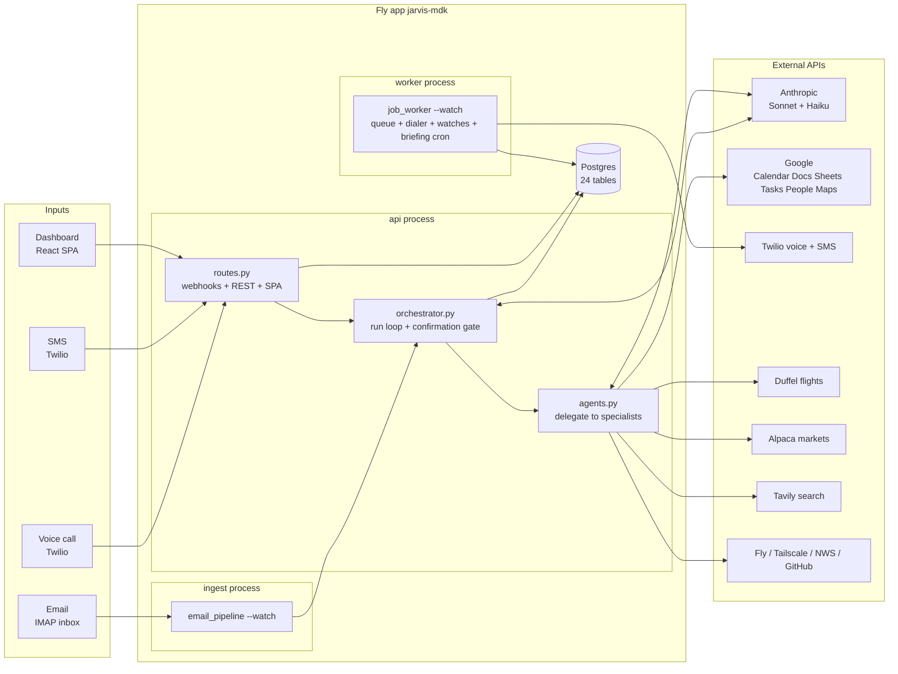
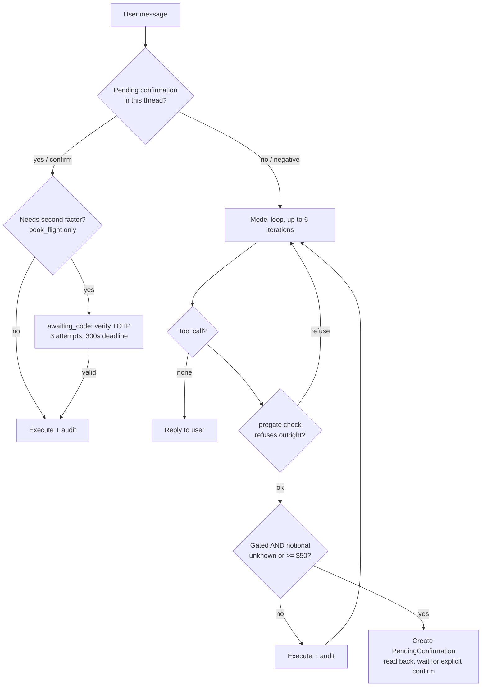
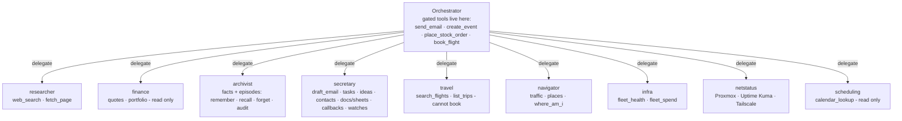

# JARVIS — Architecture

> **This is a living document.** Any PR that changes system structure — a new tool, agent,
> table, channel, job kind, or gate rule — must update the relevant section and diagram here.
> That rule is enforced by `CLAUDE.md` at the repo root, so Claude Code sessions maintain it
> automatically. Last full audit: 2026-07-17.

JARVIS is a personal assistant reachable by **voice call, SMS, email, and a web dashboard**.
One FastAPI app + React SPA, one Postgres database, deployed as a single Fly.io app
(`jarvis-mdk`) running three processes. All intelligence flows through one orchestrator
loop (Claude Sonnet) that delegates to specialist sub-agents and keeps every irreversible
action behind a confirmation gate.

---

## 1. System at a glance



Every channel funnels into the same entrypoint:
`orchestrator.run(db, channel, thread_key, user_text, actor, subject)`.

---

## 2. Deployment & CI

| Piece | Detail |
|---|---|
| Fly app | `jarvis-mdk`, region `sjc`, one shared-cpu 512 MB VM running all three processes |
| `api` | `uvicorn app.main:app` — webhooks, REST API, SPA, voice background tasks |
| `ingest` | `python -m app.channels.email_pipeline --watch` — IMAP poll every 120 s |
| `worker` | `python -m app.workers.job_worker --watch` — job queue, outbound dialer, watch engine, briefing scheduler |
| Migrations | `release_command = "alembic upgrade head"` (12 migrations, `0001`–`0012`) |
| CI (`.github/workflows/fly-deploy.yml`) | PRs → pytest only. Push to `main` → pytest, then `flyctl deploy --remote-only`. Docs-only pushes (`docs/**`, `**.md`) skip both. |
| Image | Two-stage Dockerfile: Node 20 builds the Vite SPA into `/static`, Python 3.11 runs the backend and serves it |

---

## 3. Channels and their trust model

Auth is per-channel and deliberately unequal — the security spine of the system:

| Channel | Entry | Auth | Strength |
|---|---|---|---|
| Dashboard | `POST /api/chat` etc. | JWT (bcrypt login) | strong |
| Email | `ingest` IMAP poll | sender whitelist (`ALLOWED_SENDERS` + `contacts_whitelist`) | strong |
| SMS | `POST /api/sms/inbound` | Twilio signature + number whitelist | strong |
| **Voice** | `POST /api/voice/*` | Twilio signature + **caller-ID whitelist** | **weak — spoofable** |
| Location ping | `POST /api/location` | shared secret header, constant-time compare | strong |
| Outbound calls | worker dialer | hard `ALLOWED_NUMBERS` check at schedule **and** dial time | can only ring the owner |

Because caller-ID is spoofable, voice runs restricted allowlists (`VOICE_TOOLS_PHASE1`,
`VOICE_AGENTS_PHASE1` in `channels/voice_pipeline.py`): `place_stock_order` is unreachable,
and `book_flight` is allowed *only* because its TOTP second factor is the one control a
spoofed caller cannot beat.

Channel quirks that matter:

- **Voice** cannot orchestrate inline (Twilio webhook timeout ~15 s vs up to 6 model
  round-trips), so `/voice/gather` returns TwiML immediately, runs the turn as a background
  task parked in `voice_turns`, and `/voice/poll` collects it. `thread_key` is the
  **CallSid** — a call is a bounded session, so a stale "yes" from a previous call can never
  resolve a new confirmation. Replies pass through `_speakable()` which strips URLs before
  text-to-speech. Each completed call emails the owner a transcript and enqueues episodic
  distillation.
- **Email** has one deliberate hole: airline confirmation emails from non-whitelisted
  senders are never orchestrated, but *are* parsed into the `trips` table
  (`travel.record_trip_from_email`).
- **SMS** replies also mirror to the owner's email when `sms_email_copy` is on.

---

## 4. The orchestrator and the confirmation gate

`orchestrator.run()` is the only place tools execute with a gate. The loop: resolve any
pending confirmation first; otherwise build the system preamble (Tier-1 ground truth +
relevant memories + instructions, plus voice instructions on calls) and run up to
`_MAX_ITERS = 6` Anthropic round-trips, executing tools between them.



**What is gated** (registered top-level only, in `handlers/base.py::build_registry`):

| Tool | Gate behavior |
|---|---|
| `send_email` | always confirms — mail in the owner's name is irreversible |
| `create_event` | confirms **only with attendees** (an invite emails people); solo events run immediately |
| `place_stock_order` | notional threshold ($50); also hard-disabled unless `ENABLE_TRADING` |
| `book_flight` | confirm **+ TOTP code** + pregate (offer must come from this thread's own search, ≤ `max_booking_usd`) |

Everything else executes immediately — the prompt explicitly forbids preemptive
"shall I?" asking for ungated actions.

**Structural safety, not convention:** the gate exists only in `run()`. Sub-agents
(`agents.run_agent`) call the registry directly, so they *refuse* any gated or unknown tool
outright. A misconfigured agent roster fails closed. Voice confirmation vocabulary is
narrowed — "ok"/"yeah" never trigger a gated action; "confirm"/"affirmative"/"execute" do.

---

## 5. Agents

The roster is **data-driven**: `AgentConfig` rows (editable live in the Admin UI) seeded
from `agents.DEFAULT_AGENTS`. `delegate` is the only route from the orchestrator to a
specialist; sub-agent registries never contain `delegate` (no recursion) or gated tools.



Sub-agents with date-sensitive tools get real "now" injected and stale-date flagging on
their output. Every sub-agent tool call is audited as `agent:tool` in `actions_audit`.

The division of labor is intentional: specialists **prepare** (draft, search, look up),
the orchestrator **commits** (send, book, create with invites) — under the gate.

---

## 6. Tool inventory

~45 tools across `backend/app/handlers/`. Gated tools in **bold**.

| Domain | Tools | External API |
|---|---|---|
| Email | draft_email, **send_email** | Gmail SMTP |
| Calendar | calendar_lookup, **create_event** | Google Calendar |
| Tasks | add_task, list_tasks, complete_task, cancel_task | DB → Google Tasks push |
| Docs/Sheets | create_google_doc, create_google_sheet, append_to_google_doc | Google Docs/Sheets |
| Memory | remember_fact, recall_facts, forget_fact, audit_memory, recall_episodes, recall, forget_episode | pgvector / Voyage embeddings |
| Research | web_search, fetch_page | Tavily |
| Finance | get_stock_price, get_portfolio, **place_stock_order** | Alpaca |
| Travel | search_flights, list_trips, **book_flight** | Duffel |
| Navigation | get_traffic, find_place, where_am_i | Google Maps, `location_pings` |
| Contacts | whoami, lookup_contact, save_contact, list_contacts, sync_google_contacts, google_status | Google People |
| Ideas | capture_idea, list_ideas | GitHub Contents API |
| Callbacks | call_me_back, pending_callbacks, cancel_callback | Twilio (via worker) |
| Watches | watch_for, list_watches, cancel_watch | LLM judge (worker) |
| Infra | fleet_health, fleet_spend | Fly Machines + GraphQL |
| Homelab | get_node_status, get_service_health (stubbed), tailscale_status | Tailscale |
| Time | get_current_datetime | system clock + timezonefinder |

Injection defenses: web content is fenced as UNTRUSTED before the model sees it; docs
written from web-fenced content get a provenance footer; `book_flight` and
`append_to_google_doc` require an ownership row (`flight_offers` / `google_documents`)
created by JARVIS herself — an ID the model invents or was told about simply doesn't book.

---

## 7. Memory — three tiers

```mermaid
flowchart LR
    subgraph Tier 1 — authoritative
        T1[OWNER_* settings + persona_profile + preferences<br/>injected into EVERY system prompt as ground truth]
    end
    subgraph Tier 2 — learned facts
        T2[memories table + embeddings<br/>written by remember_fact or the reflector]
    end
    subgraph Tier 3 — episodic
        T3[episodes + episode_quotes<br/>distilled from whole conversations]
    end
    TURN[Every turn] -- reflect job<br/>Haiku extracts facts, dedup 0.92 --> T2
    CALL[Call completes] -- distill_episode job<br/>Haiku summarizes, quotes must be verbatim --> T3
    T1 --> PROMPT[System preamble]
    T2 -- semantic recall --> PROMPT
    T3 -- recall_episodes tool --> PROMPT
```

- **Tier 1** can never be overwritten by inference — the reflector prompt hard-guards
  against re-learning configured facts.
- **Tier 2** recall is semantic: pgvector on Postgres, in-Python cosine fallback elsewhere.
  Wrong beliefs are correctable (`forget_fact`) and auditable (`audit_memory` emails a
  stated-vs-inferred report).
- **Tier 3** distillation has a faithfulness gate: a quote is stored only if it is a
  verbatim, speaker-matched substring of the raw transcript; anything else is dropped and
  logged. Raw turns stay in cold store (`voice_turns`, `messages`) untouched.

---

## 8. Database

Postgres on Fly (SQLite in dev/tests). 24 tables in `backend/app/models.py`:

| Group | Tables |
|---|---|
| Conversation | `conversations`, `messages`, `voice_turns` |
| Memory | `persona_profile`, `preferences`, `memories`, `memory_embeddings`, `episodes`, `episode_quotes` |
| Safety/audit | `contacts_whitelist` (the auth boundary), `pending_confirmations`, `actions_audit` |
| Work | `jobs`, `tasks`, `ideas`, `watches`, `outbound_calls` |
| Domain | `trips`, `flight_offers` (only these offer_ids are bookable), `contacts`, `google_documents` (only these doc_ids are appendable), `location_pings` |
| App | `users`, `agent_configs` |

---

## 9. Jobs & the worker

Durable queue in the `jobs` table — Postgres `FOR UPDATE SKIP LOCKED` claiming, retry with
backoff, permanent-failure detection, owner notified by email on real failures (never for
`email_copy`/`reflect`/`distill_episode`, to avoid recursion).

**Job kinds:** `email_copy`, `morning_briefing`, `briefing_call`, `reflect`,
`distill_episode`, `commit_idea`, `sync_contacts`, `push_task`, `complete_task_google`.

The worker loop (5 s) also runs the **outbound dialer** (due `outbound_calls`, quiet hours
21:00–07:00 except callbacks/briefings, max 6/hr), the **watch engine** (LLM-judged
conditions that ring the owner when they fire), and an APScheduler cron for the **morning
briefing** — calendar + portfolio + weather/marine + traffic + news gathered concurrently,
composed in the principal's voice, delivered by email or phone call.

---

## 10. UI & API

React SPA (`ui/`, Vite + React Router + TanStack Query), built into the image and served
by FastAPI itself — one origin, no separate frontend deploy.

| Route | Page |
|---|---|
| `/login` | JWT login |
| `/` | Chat with JARVIS |
| `/memory` | Browse/audit/correct memories |
| `/status` | Health dashboard |
| `/admin` | **Live agent-roster editor** — tools, prompts, enable/disable per agent |

REST surface (`/api/...`): auth (`/auth/login`, `/auth/me`, `/auth/change-password`),
chat + history, memory CRUD + audit, agent-config CRUD, action audit, briefing on demand,
health probes — plus the unauthenticated-but-signed channel webhooks (`/sms/inbound`,
`/voice/*`, `/location`). Public `/`, `/privacy`, `/terms` are carrier-compliance pages.

---

## 11. Config quick reference

All env-driven via pydantic `Settings` (`backend/app/config.py`):

- **Models**: `jarvis_model=claude-sonnet-5` (orchestrator + agents), `jarvis_router_model=claude-haiku-4-5` (reflector, distiller, watch judge)
- **Gate**: `confirm_threshold_usd=50`, `booking_code_ttl_seconds=300`, `booking_code_max_attempts=3`, `max_booking_usd=3000`
- **Kill switches**: `enable_trading=False`, `booking_enabled=False`, `voice_enabled`, `outbound_calls_enabled`, `briefing_enabled`, `enable_reflector`, `episodes_enabled`
- **Identity**: `OWNER_*` block — Tier-1 ground truth and Duffel passenger data
- **Whitelists**: `ALLOWED_SENDERS`, `ALLOWED_NUMBERS` — the only identities that may command JARVIS
