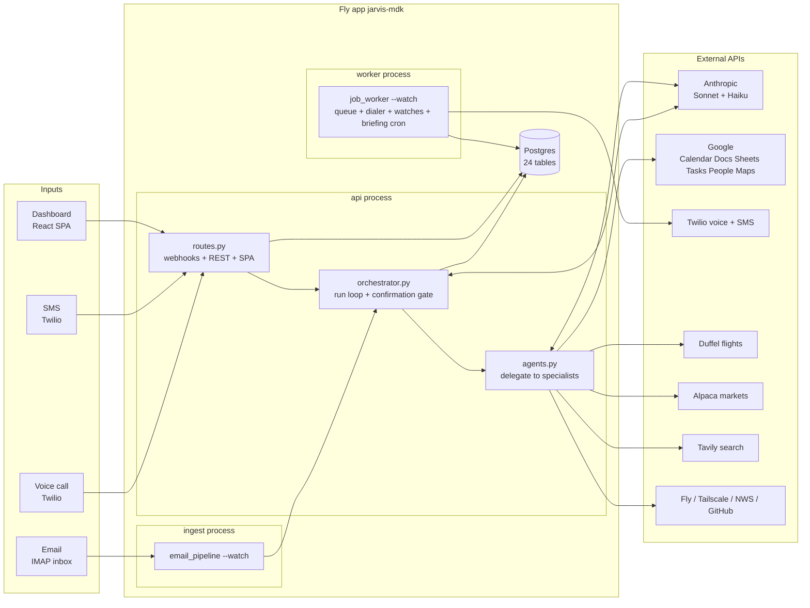
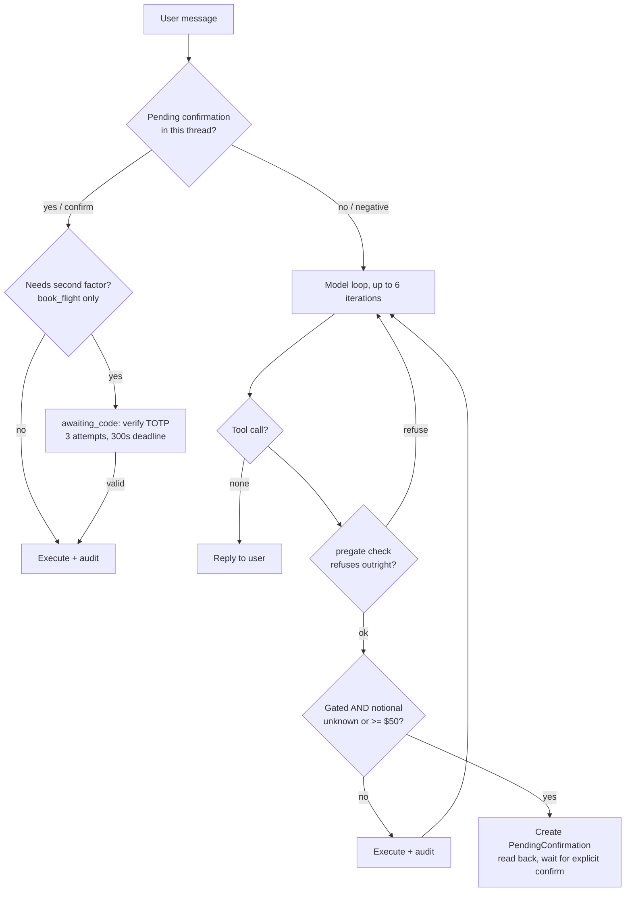
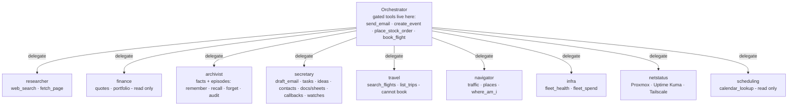

# JARVIS — Architecture

> **This is a living document.** Any PR that changes system structure — a new tool, agent,
> table, channel, job kind, or gate rule — must update the relevant section and diagram here.
> That rule is enforced by `CLAUDE.md` at the repo root, so Claude Code sessions maintain it
> automatically. Last full audit: 2026-07-17.

JARVIS is a personal assistant reachable by **voice call, SMS, email, and a web dashboard**.
One FastAPI app + React SPA, one Postgres database, deployed as a single Fly.io app
(`jarvis-mdk`) running three processes. All intelligence flows through one orchestrator
loop (Claude Sonnet) that delegates to specialist sub-agents and keeps every irreversible
action behind a confirmation gate.

---

## 1. System at a glance

```mermaid
flowchart LR
    subgraph Inputs
        PHONE[Voice call<br/>Twilio]
        SMS[SMS<br/>Twilio]
        MAIL[Email<br/>IMAP inbox]
        WEB[Dashboard<br/>React SPA]
    end

    subgraph Fly app jarvis-mdk
        subgraph api process
            ROUTES[routes.py<br/>webhooks + REST + SPA]
            ORCH[orchestrator.py<br/>run loop + confirmation gate]
            AGENTS[agents.py<br/>delegate to specialists]
        end
        subgraph ingest process
            IMAP[email_pipeline --watch]
        end
        subgraph worker process
            JOBS[job_worker --watch<br/>queue + dialer + watches + briefing cron]
        end
        DB[(Postgres<br/>24 tables)]
    end

    subgraph External APIs
        ANTH[Anthropic<br/>Sonnet + Haiku]
        GOOG[Google<br/>Calendar Docs Sheets Tasks People Maps]
        TWIL[Twilio voice + SMS]
        DUF[Duffel flights]
        ALP[Alpaca markets]
        TAV[Tavily search]
        MISC[Fly / Tailscale / NWS / GitHub]
    end

    PHONE --> ROUTES
    SMS --> ROUTES
    WEB --> ROUTES
    MAIL --> IMAP
    IMAP --> ORCH
    ROUTES --> ORCH
    ORCH --> AGENTS
    ORCH <--> ANTH
    AGENTS <--> ANTH
    AGENTS --> GOOG & DUF & ALP & TAV & MISC
    ORCH --> DB
    JOBS --> DB
    JOBS --> TWIL
    ROUTES --> DB
```

Every channel funnels into the same entrypoint:
`orchestrator.run(db, channel, thread_key, user_text, actor, subject)`.

---

## 2. Deployment & CI

| Piece | Detail |
|---|---|
| Fly app | `jarvis-mdk`, region `sjc`, one shared-cpu 512 MB VM running all three processes |
| `api` | `uvicorn app.main:app` — webhooks, REST API, SPA, voice background tasks |
| `ingest` | `python -m app.channels.email_pipeline --watch` — IMAP poll every 120 s |
| `worker` | `python -m app.workers.job_worker --watch` — job queue, outbound dialer, watch engine, briefing scheduler |
| Migrations | `release_command = "alembic upgrade head"` (12 migrations, `0001`–`0012`) |
| CI (`.github/workflows/fly-deploy.yml`) | PRs → pytest only. Push to `main` → pytest, then `flyctl deploy --remote-only`. Docs-only pushes (`docs/**`, `**.md`) skip both. |
| Image | Two-stage Dockerfile: Node 20 builds the Vite SPA into `/static`, Python 3.11 runs the backend and serves it |

---

## 3. Channels and their trust model

Auth is per-channel and deliberately unequal — the security spine of the system:

| Channel | Entry | Auth | Strength |
|---|---|---|---|
| Dashboard | `POST /api/chat` etc. | JWT (bcrypt login) | strong |
| Email | `ingest` IMAP poll | sender whitelist (`ALLOWED_SENDERS` + `contacts_whitelist`) | strong |
| SMS | `POST /api/sms/inbound` | Twilio signature + number whitelist | strong |
| **Voice** | `POST /api/voice/*` | Twilio signature + **caller-ID whitelist** | **weak — spoofable** |
| Location ping | `POST /api/location` | shared secret header, constant-time compare (the optional `nonce` is a correlator, never a credential) | strong |
| Outbound calls | worker dialer | hard `ALLOWED_NUMBERS` check at schedule **and** dial time | can only ring the owner |

Because caller-ID is spoofable, voice runs restricted allowlists (`VOICE_TOOLS_PHASE1`,
`VOICE_AGENTS_PHASE1` in `channels/voice_pipeline.py`): `place_stock_order` is unreachable,
and `book_flight` is allowed *only* because its TOTP second factor is the one control a
spoofed caller cannot beat.

Channel quirks that matter:

- **Voice** cannot orchestrate inline (Twilio webhook timeout ~15 s vs up to 6 model
  round-trips), so `/voice/gather` returns TwiML immediately, runs the turn as a background
  task parked in `voice_turns`, and `/voice/poll` collects it. `thread_key` is the
  **CallSid** — a call is a bounded session, so a stale "yes" from a previous call can never
  resolve a new confirmation. Replies pass through `_speakable()` which strips URLs before
  text-to-speech. Each completed call emails the owner a transcript and enqueues episodic
  distillation.
- **Slow turns can be held.** When a turn outruns the poll budget (~40 s), she offers to
  hold the line or hand off. Saying "wait" enters `/voice/hold` — a listen-free loop that
  plays hold music (`voice_hold_music_url`) or brief reassurance and re-checks the *same*
  running turn, so a silent waiting caller is never looped with "Still there?". The answer
  is spoken the moment it's ready; after `voice_hold_max_seconds` (default 300) she hands
  off, and the finished answer is emailed via the `notify_email` flag on the turn row.
- **Email** has one deliberate hole: airline confirmation emails from non-whitelisted
  senders are never orchestrated, but *are* parsed into the `trips` table
  (`travel.record_trip_from_email`).
- **Email is the only channel that quotes**, so inbound bodies are passed through
  `channels/email_pipeline.py::strip_quoted_text` — a pure function, no DB and no network,
  the same shape as `secretscan` — before they reach `orchestrate()`. It truncates at the
  first quote marker (Gmail/Apple attribution incl. hard-wrapped, bare `>` levels, Outlook
  `-----Original Message-----` / rule / header block, and the `-- ` signature delimiter) and
  keeps what is above it. Without it a reply saying "Confirm." carries the whole thread, and
  `orchestrator._bare_match` — which requires *every* token to be affirmative-or-filler —
  fails on every reply, so no emailed confirmation can ever resolve (F-003).
  Two rules make it safe rather than merely effective: an **interleaved** reply, where the
  owner typed *below* a quote level, is left intact so it falls through to normal handling as
  the new instruction it is; and if stripping would yield **nothing**, the original body is
  returned — a stripper that can silently erase a message is worse than one that
  under-strips. It is applied at the single `orchestrate()` call site and **not** inside
  `_body_text`, because the trip-capture path above parses the full airline email.
- **SMS** replies also mirror to the owner's email when `sms_email_copy` is on.

---

## 4. The orchestrator and the confirmation gate

`orchestrator.run()` is the only place tools execute with a gate. The loop: resolve any
pending confirmation first; otherwise build the system preamble (Tier-1 ground truth +
relevant memories + instructions, plus voice instructions on calls) and run up to
`_MAX_ITERS = 6` Anthropic round-trips, executing tools between them.

```mermaid
flowchart TD
    U[User message] --> P{Pending confirmation<br/>in this thread?}
    P -- "yes / confirm" --> TOTP{Needs second factor?<br/>book_flight only}
    P -- no / negative --> LOOP[Model loop, up to 6 iterations]
    TOTP -- yes --> CODE[awaiting_code: verify TOTP<br/>3 attempts, 300s deadline]
    TOTP -- no --> EXEC[Execute + audit]
    CODE -- valid --> EXEC
    LOOP --> TU{Tool call?}
    TU -- none --> REPLY[Reply to user]
    TU --> PG{pregate check<br/>refuses outright?}
    PG -- refuse --> LOOP
    PG -- ok --> G{Gated AND notional<br/>unknown or >= $50?}
    G -- no --> RUN[Execute + audit] --> LOOP
    G -- yes --> PEND[Create PendingConfirmation<br/>read back, wait for explicit confirm]
```

**What is gated** (registered top-level only, in `handlers/base.py::build_registry`):

| Tool | Gate behavior |
|---|---|
| `send_email` | always confirms — mail in the owner's name is irreversible |
| `create_event` | confirms **only with attendees** (an invite emails people); solo events run immediately |
| `place_stock_order` | notional threshold ($50); also hard-disabled unless `ENABLE_TRADING` |
| `book_flight` | confirm **+ TOTP code** + pregate (offer must come from this thread's own search, ≤ `max_booking_usd`) |
| `create_project_from_idea` | confirm + pregate (idea exists, not already promoted, GitHub configured, name given) — creates a new GitHub repo from a captured idea |

Everything else executes immediately — the prompt explicitly forbids preemptive
"shall I?" asking for ungated actions.

**Structural safety, not convention:** the gate exists only in `run()`. Sub-agents
(`agents.run_agent`) call the registry directly, so they *refuse* any gated or unknown tool
outright. A misconfigured agent roster fails closed. Voice confirmation vocabulary is
narrowed — "ok"/"yeah" never trigger a gated action; "confirm"/"affirmative"/"execute" do.

**Confirmation hygiene & batching.** A pending confirmation expires after a TTL (a stale
"yes" can't fire an hours-old action), and only a *bare* affirmative confirms — "yes, and
also do X" is a new request, not a confirmation.

**The TTL is per-channel**, for the same reason `_VOCAB` is: the transports are not alike.
`orchestrator._ttl(db, channel)` is the single source of the rule — **both** the age check in
`_resolve_pending` and the cutoff in `_expire_stale_pending` read through it, so the two
cannot drift into disagreeing about what "stale" means, and `_expire_stale_pending` is passed
the channel explicitly rather than inferring it from the thread key.

| Channel | TTL | Why |
|---|---|---|
| `voice` / `web` / `sms` | `pending_confirmation_ttl_seconds` (900) | A call is bounded by CallSid; chat is a live session; a stale SMS "yes" is a real hazard. Unchanged. |
| `email` | `email_confirmation_ttl_seconds` (14400 = 4h), runtime-tunable, bounds 300–86400 | Mail latency is hours, not minutes — observed reply gaps of 76/32/45 min all died against 900s (F-003). Bounded by the working day rather than the session: long enough for a reply from bed, short enough that yesterday's readback is dead. |

Only channels that *differ* are named in `_TTL_KEYS`; everything else takes the default, so
widening one transport can never quietly widen the others. The TTL is a safety control, which
is why it was not simply raised globally.

A compound "do this, that, and the other" is handled in one turn in **two passes**: pass 1
executes every ungated action (tasks, docs, sheets) and any outright refusals; pass 2 buffers
the gated ones. So no-confirmation deliverables are always completed — and their results in
hand — before any gated action is queued (tool results are still returned in the model's
original order, matched by id). The gated actions raised in that turn share a `batch_id`, so
they read back as one numbered set and a single "confirm" runs them all in creation order with
one combined summary (or "cancel" drops them all). `book_flight`'s TOTP second factor is never
batched — it keeps its own flow. Cross-turn ordering (the model issuing all ungated tool calls
in the same turn) is prompt-directed, not code-enforced. See
`docs/TDD-multi-action-buffering.md`.

---

## 5. Agents

The roster is **data-driven**: `AgentConfig` rows (editable live in the Admin UI) seeded
from `agents.DEFAULT_AGENTS`. `delegate` is the only route from the orchestrator to a
specialist; sub-agent registries never contain `delegate` (no recursion) or gated tools.

```mermaid
flowchart TD
    ORCH[Orchestrator<br/>gated tools live here:<br/>send_email · create_event · place_stock_order · book_flight]
    ORCH -- delegate --> R[researcher<br/>web_search · fetch_page]
    ORCH -- delegate --> F[finance<br/>quotes · portfolio - read only]
    ORCH -- delegate --> A[archivist<br/>facts + episodes: remember · recall · forget · audit]
    ORCH -- delegate --> S[secretary<br/>draft_email · tasks · ideas · contacts · docs/sheets · callbacks · watches]
    ORCH -- delegate --> T[travel<br/>search_flights · list_trips - cannot book]
    ORCH -- delegate --> N[navigator<br/>traffic · places · where_am_i]
    ORCH -- delegate --> I[infra<br/>fleet_health · fleet_spend]
    ORCH -- delegate --> NS[netstatus<br/>Proxmox · Uptime Kuma · Tailscale]
    ORCH -- delegate --> SC[scheduling<br/>calendar_lookup - read only]
```

Sub-agents run a bounded tool loop (`run_agent`, `_MAX_ITERS` iterations). If an agent
spends its whole budget still calling tools without writing an answer, `run_agent` forces
one final no-tools synthesis pass from the evidence gathered — so a research turn always
returns a real answer, never an empty `(no result)` that surfaces as "the agent failed".
Sub-agents with date-sensitive tools get real "now" injected and stale-date flagging on
their output. Every sub-agent tool call is audited as `agent:tool` in `actions_audit`.

**Audit status is outcome-derived, not assumed.** Tool execution runs through the single
seam `Registry.run_tool()`, which returns `(result, status)`: a handler that raises
`ToolFault` (or any exception) — e.g. a Calendar 401, a Duffel key rejection, an
unreachable Tavily — is recorded as `status="error"`, a healthy call as `ok`. Handlers
raise `ToolFault` (message preserved verbatim, so the user still sees the guidance)
*instead of* returning a hand-worded error string; the registry catches it so a failure
still never crashes the loop. Gate decisions are written literally, not derived:
`confirmed` (the user approved) and `refused` (a sub-agent hit the top-level-only gate, or
a pre-gate refusal) both stay in the ok-family — a refused booking is a healthy system.
This makes `actions_audit` a truthful substrate that credential/liveness health checks can
read to tell a real failure from silence.

The division of labor is intentional: specialists **prepare** (draft, search, look up),
the orchestrator **commits** (send, book, create with invites) — under the gate.

---

## 6. Tool inventory

~55 tools across `backend/app/handlers/`. Gated tools in **bold**.

| Domain | Tools | External API |
|---|---|---|
| Email | draft_email, **send_email** | Gmail SMTP |
| Calendar | calendar_lookup, **create_event** | Google Calendar |
| Tasks | add_task, list_tasks, complete_task, cancel_task | DB → Google Tasks push |
| Docs/Sheets | create_google_doc, create_google_sheet, append_to_google_doc | Google Docs/Sheets |
| Memory | remember_fact, recall_facts, forget_fact, audit_memory, recall_episodes, recall, forget_episode | pgvector / Voyage embeddings |
| Research | web_search, fetch_page | Tavily |
| Finance | get_stock_price, get_portfolio, **place_stock_order** | Alpaca |
| Travel | search_flights, list_trips, **book_flight** | Duffel |
| Navigation | get_traffic, find_place, where_am_i | Google Maps, `location_pings` |
| Contacts | whoami, lookup_contact, save_contact, list_contacts, sync_google_contacts, google_status | Google People |
| Ideas | capture_idea, list_ideas, get_idea, **create_project_from_idea** (gated) | GitHub Contents API + `POST /user/repos` |
| Projects | create_project, promote_idea, list_projects, project_status, add_milestone, complete_milestone, drop_milestone, set_project_status, attach_document, supersede_document | DB only |
| Repos | **commit_document** (branch + PR, never `main`, never merges; ungated but registered **top-level** so the voice allowlist excludes it — see below), **create_project_repo** (**GATED** — creates a repo, seeds the scaffold; public by default) | GitHub |
| Planning | start_planning, add_planning_note, planning_status, next_planning_question, abandon_planning (the interview engine), emit_tdd (**top-level**, not voice-reachable) | DB + Haiku classify |
| Inception | propose_milestone_date, ratify_plan (**the only routine path that writes a baseline**), replan, reset_baseline, project_timeline, flag_risk, break_assumption, resolve_risk, list_plan_risks, emit_project_plan (**top-level**, not voice-reachable) | DB + GitHub |
| Callbacks | call_me_back, pending_callbacks, cancel_callback | Twilio (via worker) |
| Watches | watch_for, list_watches, cancel_watch | LLM judge (worker) |
| Infra | fleet_health, fleet_spend | Fly Machines + GraphQL |
| Homelab | get_node_status, get_service_health (no LAN backend yet — report "not configured", never invented status), tailscale_status | Tailscale |
| Time | get_current_datetime | system clock + timezonefinder |

Injection defenses: web content is fenced as UNTRUSTED before the model sees it; docs
written from web-fenced content get a provenance footer; `book_flight` and
`append_to_google_doc` require an ownership row (`flight_offers` / `google_documents`)
created by JARVIS herself — an ID the model invents or was told about simply doesn't book.

**Ideas → projects.** A captured idea (`capture_idea`, committed to the fixed `jarvis-ideas`
repo) can be read back in full (`get_idea`) and promoted into a brand-new GitHub repo:
`create_project_from_idea` (gated) creates the repo via `POST /user/repos`, seeds a README +
the idea, and records `Idea.promoted_url`. The orchestrator asks for the repo name if the user
didn't give one; the gate confirms before anything is created. See
`docs/TDD-idea-to-project.md`.

---

## 7. Memory — three tiers

```mermaid
flowchart LR
    subgraph Tier 1 — authoritative
        T1[OWNER_* settings + persona_profile + preferences<br/>injected into EVERY system prompt as ground truth]
    end
    subgraph Tier 2 — learned facts
        T2[memories table + embeddings<br/>written by remember_fact or the reflector]
    end
    subgraph Tier 3 — episodic
        T3[episodes + episode_quotes<br/>distilled from whole conversations]
    end
    TURN[Every turn] -- reflect job<br/>Haiku extracts facts, dedup 0.92 --> T2
    CALL[Call completes] -- distill_episode job<br/>Haiku summarizes, quotes must be verbatim --> T3
    T1 --> PROMPT[System preamble]
    T2 -- semantic recall --> PROMPT
    T3 -- recall_episodes tool --> PROMPT
```

- **Tier 1** can never be overwritten by inference — the reflector prompt hard-guards
  against re-learning configured facts.
- **Tier 2** recall is semantic: pgvector on Postgres, in-Python cosine fallback elsewhere.
  Wrong beliefs are correctable (`forget_fact`) and auditable (`audit_memory` emails a
  stated-vs-inferred report).
- **Tier 3** distillation has a faithfulness gate: a quote is stored only if it is a
  verbatim, speaker-matched substring of the raw transcript; anything else is dropped and
  logged. Raw turns stay in cold store (`voice_turns`, `messages`) untouched.

---

## 8. Database

Postgres on Fly (SQLite in dev/tests). 40 tables in `backend/app/models.py`:

| Group | Tables |
|---|---|
| Conversation | `conversations`, `messages`, `voice_turns` |
| Memory | `persona_profile`, `preferences`, `memories`, `memory_embeddings`, `episodes`, `episode_quotes` |
| Safety/audit | `contacts_whitelist` (the auth boundary), `pending_confirmations`, `actions_audit` (per-*tool*), `request_log` (per-*request* — one coarse row per top-level request; retention 90d + row cap) |
| Work | `jobs`, `tasks`, `ideas`, `watches`, `outbound_calls` |
| Projects | `project`, `milestone` (+ inception date columns), `project_document` (multi-session arcs — see below), `github_write_log` (one row per attempted GitHub write; the health substrate for GitHub, see below), `planning_session` + `planning_note` (the interview engine — see below), `replan` + `baseline_reset` + `plan_risk` + `plan_assumption` (inception — see below) |
| Domain | `trips`, `flight_offers` (only these offer_ids are bookable), `contacts`, `google_documents` (only these doc_ids are appendable), `location_pings` (+ `request_id`, and a descriptive `trigger` that no health check reads), `location_requests` (the server-initiated ask a ping answers) |
| App | `users`, `agent_configs`, `runtime_settings` (behavioral overrides — see below), `scheduler_heartbeat` (briefing-scheduler proof-of-life + catch-up state) |
| Health | `component` (topology inventory), `remediation` (fault→runbook), `health_result` (transient current status), `capability` + `capability_member` (the user-facing rollup — see below), `evaluator_heartbeat` (proof-of-life for health checking *itself*) |

**Project tracking** (`app/handlers/projects.py`, `docs/TDD-project-tracking.md`): the durable
answer to "where am I on this?" Every multi-session arc previously lived in session close-out
documents and the owner's head — excellent narrative records, terrible state stores. `project`
holds the arc (`active` / `parked` / `done` / `abandoned`), `milestone` the ordered checkpoints
(sparse positions so an insertion never renumbers), `project_document` the documents by **tier**
(`live` / `archive` / `operational`, mirroring the `docs/` repo convention so "what's the design
for X" returns the live doc, singular). **The boundary against `tasks`:** a task is a discrete
action with a due date, done in one sitting; a project is a multi-session arc. Nothing enforces
that in the schema and nothing should. Load-bearing rules: **`parked` requires a reason** (ideally
a resumption condition — parked-without-one is indistinguishable from abandoned), **`dropped` ≠
`done`** (a dropped milestone counts toward neither numerator nor denominator, or progress is
overstated), and **ambiguity asks** (completing the wrong milestone is a silent data error that
looks like progress). Promotion from an idea is a status change plus a link, never a move or a
delete — `ideas.status` is orthogonal to the older `ideas.promoted_url`, which records that a
GitHub *repo* exists. All tools ungated (reversible bookkeeping must not dilute the gate) and all
voice-reachable, because "where am I" is a question asked from a boat.

> **THE PROJECT-MANAGEMENT ARC IS COMPLETE** as of 2026-08-01 — TDD #1 (project tracking), TDD #2
> (planning sessions / the interview engine), TDD #3 (repo scaffolding & document commits), and
> **inception, the capstone**, all shipped across PRs #40 and #53–#63.
>
> Where the reconstructed inception TDD differed from what shipped, and why: **migration numbers**
> — §5 says `0026`, which the github write log consumed; inception landed at `0028` with a follow-on
> `0029` for the draft/surface markers (five stale numbers across the arc, which is why the standing
> rule is *confirm against live head, never trust a draft*). **Emit is real, not stubbed** — §8's
> "stub the commit until TDD #3 exists" is dead: TDD #3 shipped first, so `emit_project_plan` wires
> to the actual `commit_document`. **§11's atomicity question is resolved**, not deferred — see
> below. **§6.3's "emit calls `create_project_repo`" was not implementable as written**: that tool
> is gated and the gate runs in the orchestrator, so calling it from inside an ungated tool would
> execute an irreversible outward action with no confirmation. Emit refuses and points at the gated
> tool instead.

**Project inception** (`docs/TDD-project-inception.md`, **complete**): the capstone, and it is
**a session type on the interview engine, not a second engine**. `planning_session.target` gains
`project_plan`; the same table, the same cross-channel note accumulation, and the same gate apply,
with a richer slot set — `objectives`, `milestones` (≥2), `risks`, `assumptions`, plus `tasks` as
the conditional. `risks` and `assumptions` are inception's unfakeable pair, exactly parallel to
`rejected` / `open_questions`: you cannot generate a real risk from a project *name*. It takes a
**subset** of the base slots deliberately — not `tests` or `data_model`, because requiring a test
plan for "restore the boat" is a bar that gets routed around rather than met.

Slot sets are keyed by session type (`SLOT_SETS`, `slot_set_for`). That refactor is what made reuse
possible: readiness previously read one module-level slot list and could not tell which kind of
session it was judging, so a richer set would have needed either a parallel readiness function (a
second gate) or a widened set for everyone (weakening the engine inception extends). An unknown
type falls back to the **stricter** base set — a bug must not silently relax a gate — and a test
asserts the base types still gate on their own slots, because that regression would be invisible
from inception's own tests.

**Dates, baseline, and the timeline** (`app/inception.py` + `app/handlers/inception.py`, steps 3–4):
`propose_milestone_date` records a floated date as `proposed` and **writes no baseline**;
`ratify_plan` is the one-way gate that sets `baseline_date = current_date`, once. **Only
`ratify_plan` and `reset_baseline` may write a baseline** — greppped in test as well as exercised,
because the tempting shortcut (set it when the date is first proposed, it's simpler) destroys the
guarantee while looking like a tidy-up. Before ratification nothing can slip and the timeline says
so. `replan` writes the `replan` row **before** moving `current_date` — asserted by failing the log
write and checking the date did not move — and never touches the baseline. `reset_baseline`
snapshots the whole prior baseline **before** overwriting, because an unlogged re-baseline is
indistinguishable from hiding a slip. `slippage_days` returns `None`, not `0`, for anything
unratified: zero is a claim of on-time, `None` is "nothing to measure". An *open* milestone slips
by today's reckoning rather than its plan date, or a stalled project would report as on-plan.
`project_timeline` states **facts, never a verdict** — the day count, with an enumerated
`JUDGMENT_WORDS` list asserted absent, so breaking §6 requires consciously deleting a list.
Milestones create **no reminders** (§4.5): a milestone date is a plan the timeline reads, a task
date pings, and collapsing them means either every milestone nags or tasks stop reminding.

**Schema (migration `0028`)**: `milestone.baseline_date` / `current_date` /
`date_status` (`none`/`proposed`/`ratified`), plus `replan`, `baseline_reset`, `plan_risk`,
`plan_assumption`. **The fabrication guard in scheduling form** — a date elicited in an interview is
`proposed` and sets no baseline; only ratification writes `baseline_date`, so *you cannot slip from
a date you never agreed to*. A replan is a **logged event, not a field edit**: `replan.reason` and
`baseline_reset.reason` are `NOT NULL` **at the column**, because enforcing it only in the tool
leaves the silent edit one direct write away. Risks and assumptions are **rows, not prose**, so a
risk can be resurfaced when it bites rather than sitting inert in section 9. **All seven steps
shipped** (#61, #62, #63).

**Emit, and the atomicity resolution** (`emit_project_plan`, §11): a `project_plan` session becomes a
committed plan document **and** seeded live rows — or nothing at all. A GitHub PR and a DB
transaction cannot share one transaction, so the sequence puts the **reversible half first**: seed
rows as `draft` → commit the document via the real `commit_document` → **promote to `live` only on
success**; on failure delete the drafts and leave the session `open`. Success is judged on **state**
(a new `ProjectDocument` row), never on the prose the writer returned — deciding it by
pattern-matching another tool's wording is the proxy-signal defect one layer up. Both failure modes
are covered: `commit_document` can *raise* (a GitHub fault) or *refuse* by returning a string (no
token, scanner hit), and a negative validation proved a plant survived the first test until the
second was written. A draft row that outlives a failure is **visible** in `project_timeline`, never
silent (§11.8). The draft marker is **row-level `plan_status`** rather than a session flag — not a
style choice: seeded rows carry `project_id`, not `session_id`, so a session flag could never
identify which rows were drafts. Emit is **top-level and therefore voice-excluded**: it is an
outward write to a repo that is public by default. One note, one row, **verbatim** — no LLM
extraction, because inventing structure from prose is the fabrication this arc spent seven steps
refusing. Milestones are deliberately **not** seeded from prose: a milestone needs a title and a
date, and manufacturing either would fabricate a commitment.

**Brief integration** (`brief_project_lines`, §6): **exception-first — silence is the default.** A
project on or ahead of baseline produces no line; a project with **no ratified baseline is
invisible**, which is the step-3 fabrication guard arriving at the brief. Slippage past
`project_slippage_brief_days` (default **2**, not 0 — a one-day slip is noise, and a brief that
reports noise is one the owner stops reading) surfaces as a day count. **An open milestone slips by
today's reckoning**, so a *stalled* project surfaces rather than reporting on-plan — fabricated-green
in another costume. A risk linked to a slipping milestone resurfaces; a broken assumption surfaces
**once**, stamped on **delivery** rather than compose, so a brief that fails to send cannot consume
the single flag the owner was owed. The lines reuse the **same** `JUDGMENT_WORDS` list as the
timeline — asserted un-forked, because two lists drift and the one that drifts is the one nobody is
looking at.

**Planning sessions** (`app/planning.py` + `app/handlers/planning.py`, `docs/TDD-planning-sessions.md`):
the interview engine. A session is an **object, not a conversation** — notes accumulate into slots
across channels, so an idea by SMS at the dock, three more by voice on the drive, and the real work
at a keyboard are one session. `planning_note` is **append-only and verbatim**: a misclassified note
is *reclassified* (its `slot` changes), never edited, because the raw capture is the evidence a real
argument happened and evidence the judged party can edit is not evidence. At most one `open` session
— refused on **ambiguity**, not tidiness: with two open, a stray SMS has no unambiguous home.

**The completeness gate (`session_readiness`) is the invention; everything else is plumbing.** It
exists because on 2026-07-20 JARVIS was asked for a TDD and produced one with every section present
and every section a placeholder — a document's *shape* is trivially generatable, its *content* is
the residue of an argument. The gate judges **substance, not presence**: placeholder tokens are
stripped and what remains is measured against `planning_min_slot_chars` (120, a setting because §11
admits it is arbitrary). Two slots are treated as unfakeable — `rejected` needs an alternative **and
why it lost** (an alternative without a reason is a list), and an empty `open_questions` is
*evidence of insufficient thought, not of thoroughness*, which the refusal says out loud.
`data_model` is required unless explicitly marked not-applicable, and that marking is recorded —
"no schema change" is a design statement, silence is not. The gate returns **what is missing and the
question that fills it**, so refusal moves the session forward. It catches empty, **not shallow**
(§5.4), and that ceiling is stated rather than implied.

**Nothing can emit yet, deliberately (§9)** — `emit_tdd` is a later build. Emission built first
produces a system that emits with a gate bolted on afterwards, which is how gates end up bypassable;
a test asserts no emit path exists so the ordering is a fact rather than an intention. Note
classification uses Haiku and **fails to unclassified, never to a guess**: since the gate reads slot
content, a confidently wrong slot quietly pads another slot's substance and is a way *through* the
gate. Voice-reachable for capture and interrogation (§4.2); when `emit_tdd` lands it must **not** be
added to `VOICE_TOOLS_PHASE1` — reviewing a design by having it read aloud is not review.

> **TDD #3 (repo scaffolding & document commits) is COMPLETE** as of 2026-08-01 — steps 1–7
> shipped in PRs #53–#57. The five subsections below are its surface: the write log, the secret
> scanner, the scaffold template, document commits, gated repo creation, and the write-health
> component. `docs/TDD-repo-scaffolding.md` §11 records where the draft disagreed with the code
> and what was ratified instead.

**GitHub writes** (`github_write_log`, `docs/TDD-repo-scaffolding.md` §5/§7/§11): one row per
*attempted* write — `operation` (`create_repo` / `commit_doc` / `open_pr`), `target`, `ref`, `ok`,
`error`. It exists because a partial write is currently invisible: the shipped repo-seeding loop in
`create_project_from_idea` swallows a failed `PUT` and still reports success (§11.8), so a
half-seeded repo reads as a whole one. **The table is also the health substrate for GitHub, by
design rather than convenience** — the routine thing that exercises GitHub is the `commit_idea`
*job*, and jobs write no `actions_audit` rows, so an audit-derived liveness check would be starved
from birth: `unknown` forever, or latched on its first failure with nothing able to clear it (the
calendar latch, rebuilt). Reading this log sidesteps that on one invariant that must hold as
writers are added: **every GitHub write path writes a row here, the job included.** The table
landed ahead of its writers (steps 3/5) so they have somewhere to write. `error` never holds a
secret.

**Secret scanner** (`app/secretscan.py`, TDD #3 §4.5): a pure classifier — text in, findings out,
no network, no file reads, no logging. Catches named token prefixes (`ghp_`, `github_pat_`,
`duffel_`, `sk-ant-`, `xoxb-`, `AIza`, Twilio SID), private-key headers, and high-entropy strings
(≥32 chars, ≥4.5 bits/char — a floor above `log2(16)=4.0` so hex digests are excluded *by
construction*, which is what keeps it off the SHAs and UUIDs a design document is full of). It is
**not** a registered tool and takes no audit row: it is an internal function, not a component with
liveness. Detection and enforcement are deliberately separate — the scanner reports, the *writer*
aborts — so the classifier is testable offline and the refusal is asserted at the call site.
**A finding carries a pattern name and a location, never the matched value**, asserted in test:
its output is bound for `github_write_log`, which is stored *and* rendered on the status page, so
a leak there leaks twice. Built and proven before any writer exists (§8), which stopped being
prudence and became a safety property when public-by-default repo visibility was ratified (§11.3).

**Scaffold template** (`app/scaffold/`, TDD #3 §4.4): the standard new-project structure —
`README.md`, `ARCHITECTURE.md`, `docs/README.md`, `docs/archive/.gitkeep`,
`docs/operational/.gitkeep`, `.gitignore` — stored as **tracked files** under
`app/scaffold/template/`, never as a string in code. That is the whole point: a structure
regenerated from memory each time drifts, and drift in the thing whose job is preventing drift is
a special kind of failure. Because the template is tracked, a scaffold change is a reviewable diff.
`render_scaffold(project_name, description, now)` substitutes `{{PROJECT_NAME}}` /
`{{DESCRIPTION}}` / `{{DATE}}` and returns the file set; the placeholder key set is **derived from
the template**, so a token nobody supplies raises rather than shipping literal `{{...}}` into a
repo. Pure — no network, no DB, no repo — which is why the structure is fully proven offline
before step 6's gated repo creation touches anything (the same detect/enforce split as
`secretscan` vs `commit_document`). `docs/README.md` carries the tier convention verbatim and is
asserted byte-identical to the template. Two runtime hazards are guarded: the template stores
`gitignore.template` (a literal `.gitignore` there would be a *live* gitignore for its own
subtree), and `render_scaffold` **refuses to render an incomplete template** — `.dockerignore`
excludes `*.md`, three of the six files are markdown, and an image missing them would seed repos
with no README while every offline test passed. `.dockerignore` carries a negation for the
template path; the completeness check is what makes a regression of it loud.

**GitHub write health** (`github_writes` component, `check_github_writes`, TDD #3 §7): reads
`github_write_log` over a 7-day window — `ok` when every write landed, `degraded` on any failure,
`unknown` when nothing was written (no evidence is not health), and **never `down`**, because
being unable to commit a document is not the system being down. Same amber ceiling as
`project_hygiene`, and stated on the component so it can't become a surprise. **The substrate is
the point**: it reads the write log, *not* `actions_audit`, because the routine thing exercising
GitHub is the `commit_idea` job and jobs write no audit rows — an audit-derived check here would
be starved from birth. That was designed out at #53 by landing the table ahead of its writers, and
is pinned by a test that fails if the check ever reads the audit table instead. Declared
`external_api` / `depends_on: GITHUB_TOKEN` by analogy to `tavily`/`gmail`/`duffel`. One
`write_failed` fault code, deliberately not split by operation: a `CheckResult` carries one code,
so a window holding both a failed create and a failed commit would have to misreport one — the
operation lives in the detail instead. The detail summarises status/operation/target and never
round-trips stored `error` text onto the status page.

**Repo creation** (`create_project_repo`, `app/handlers/repos.py`, TDD #3 §4.3/§6.2 — **GATED**):
creates a repository for a tracked project and seeds the versioned scaffold. Gated because
creation is irreversible in the way a PR is not — the name is taken permanently, it is visible,
and undoing it is a manual deletion. **The readback states name, visibility, and owner**; that is
the owner's one chance to stop an unwanted public repo before it exists, so visibility in the
readback is non-negotiable. Idempotent: an existing repo is reported and *adopted* (`repo_url`
set), never re-seeded — re-seeding would clobber real work in a repo somebody already used. A
partial seed is reported **as partial**, deliberately not repeating the §11.8 defect where the
ideas path swallows failed PUTs and claims success.

**Repo visibility: PUBLIC by default on both creation paths** — ratified 2026-08-01 (§4.3 / §11.3).
KEEL doctrine: a Planner AI in a browser chat can only connect to public repos, so a private
day-one repo cannot be brought into a design session. `create_project_from_idea`'s default flipped
from private with it. **The secret scanner is the precondition that made public acceptable, and
the two may not be separated**: every byte of the scaffold, and the README + idea markdown the
idea path seeds, passes `scan_for_secrets` *before any GitHub client is constructed*. Idea bodies
are free text captured from SMS and voice and committed verbatim — the likeliest place a pasted
credential arrives, and contained under the old private default in a way it is not under a public
one. Both scan-precedes-write paths are negative-validated in test. The seed publishes **the exact
bytes that were scanned**, not a re-render. Two defaults govern one argument — the handler's and
`_summarize_promote`'s — and a test asserts they agree, because a flip of only the handler would
make the gate say "private" while creating "public". **Going private is owner action**, prompted by
the project close-out; no code path here changes an existing repo's visibility, asserted as an
absence (no `PATCH`).

**Document commits** (`app/handlers/repos.py`, TDD #3 §4.1/§6.1): `commit_document(project, title,
body, tier, kind)` — **this is where the scanner stops being detection and becomes refusal.**
`scan_for_secrets` runs on body *and* title before any GitHub client is constructed; a finding
aborts, logs a `commit_doc` row with the pattern name (never the value), and returns a refusal.
Asserted by a test that fails if the client is so much as constructed — negative-validated by
planting a scan-too-late defect and watching it fire. A refusal is deliberately **not** an audit
fault: the tool worked, and a defended write reading `error` would teach the health substrate that
being correct is a failure (the same reasoning that keeps refused gate outcomes in the ok-family).
Then: resolve the repo (**never guess** — `settings.jarvis_repo` for JARVIS herself, else
`project.repo_url`, else abort), derive the path **from the tier** (`live`→`docs/`,
`archive`→`docs/archive/`, `operational`→`docs/operational/` — there is no `path` argument on the
schema, which is what makes the convention enforced rather than hoped for), branch
`docs/<slug>-<yyyymmdd>`, commit, open a PR, **never merge** (asserted, including that no `/merge`
string exists in the module), and reuse `attach_document` so the tracker and the repo cannot
diverge through a second insert path.

**Ungated** — a branch and a PR are reversible, and diluting the gate with reversible work is how a
gate stops being read. **Not voice-reachable, structurally:** it is registered *top-level*, and
`orchestrator._run_inner` restricts the top-level registry to `VOICE_TOOLS_PHASE1` on a voice call,
so absence from that allowlist removes it. A sub-agent roster could not achieve this — all nine
agents are in `VOICE_AGENTS_PHASE1` and a roster must be a subset of the voice allowlist, so a
roster entry would drag it onto a caller-ID-authenticated channel. Config: `jarvis_repo`
(default `mdk32366/Project-Jarvis`).

**Health model** (`app/health.py`, TDD §4): a relational map of the deterministic topology.
`component` is the inventory — every agent, external API, subsystem, and data feed — each row
carrying its `kind`, `depends_on`, `check_type`, `blast_radius` (trunk subsystems are `multi`),
and `check_config` (JSON thresholds, e.g. the worker-scheduler heartbeat staleness = 300s, so
checks read the number from data, not code). `remediation` maps `(component, fault_code)` → a
stored runbook (the "place to start"), joined at surface time — detection and fix are decoupled.
`health_result` is transient (latest status per component, overwritten each check). Seeded +
**reconciled** on startup (`seed_health_topology`, the `seed_agents` lesson — kind/description/
check fields are refreshed from code so stale reference data can't persist). `component_for_tool`
is the tool→component lookup that groups `actions_audit` rows by the component they belong to
(the evidence bridge).

**Health checks** (`app/health_checks.py`, TDD §5): `run_all_checks(db)` runs each component's
check (by `check_type`) and upserts `health_result` (trunk first). A check NEVER raises into its
caller — a broken check returns `unknown` with the error in `detail`, so one can't take the page
down. v1 set: **liveness** (derives `last_success`/`last_failure` from `actions_audit` — a
`confirmed`/`refused` row counts as ok, the gate working; no evidence → `unknown`, never green),
**heartbeat** (reads `scheduler_heartbeat` vs the seeded `stale_seconds`; disabled → ok-labeled,
not down), the **location split** — `location_pull_scheduler` ("is the server asking?", reads
`location_requests` with `trigger=scheduled`; a refused send gets its own `relay_rejected`
fault code because it sends you to the key, not the worker — **but see the scope limit below,
`relay_accepted` only proves the relay took the message, not that it reached the phone**) and
`location_responsiveness` ("is the
phone answering?", scores the trailing 6 completed requests; fewer than 3 → `unknown`, never green)
— both suppressed outside the runtime active-hours window, **app up-status**, and
**`project_hygiene`** (are the project records still honest — an active project with no open
milestones, two live documents of one kind, or nothing touched in 30 days). `project_hygiene` is
never `down` by design: a bookkeeping problem rendered beside a dead scheduler would train the eye
to skip both, which is the exact failure the exception-first page exists to prevent. Secret-age (needs a Fly API token in-container) and
published-expiry (Google refresh tokens publish none — nothing honest to report) are deliberately
deferred rather than shipped as perpetual `unknown`. The **`self_whoami`** tool (ungated,
universal — registered in both registry branches like `get_current_datetime`, voice-reachable)
answers "what am I running / how are you feeling" in chat from `app/provenance.py` (commit + build
time **baked** via Dockerfile ARG, Fly deploy metadata, `in_service_days` anchored on the first
user row), a live `run_all_checks` rollup — the same state the page shows, so chat and page can't
disagree — and a **request-log** rollup ("what have I done recently"). `app/request_log.py` writes
one coarse row per top-level `orchestrator.run()` on an INDEPENDENT session (committed before the
work, resolved in `finally` on another) so a crashed request still leaves a row recorded `error`
(~4ms on the VM, off the voice critical path which orchestrates in a background task). Retention is
time-primary (90d) with a row-count safety valve, swept hourly by the worker. Liveness only counts audit rows from the
PR-0 truthful-audit epoch onward — pre-epoch rows are `ok` by construction and would be false
evidence. `status_payload(db)` (behind `GET /api/status/full`) runs the checks, upserts
`health_result`, and joins the runbook + evidence for anything not-ok. *The exception-first page
is PR-E.*

**Capability rollup** (`app/capabilities.py`, `docs/TDD-capability-status.md`): components
answer *"is this part working"*; capabilities answer *"can she still do the thing"*, which is
the question actually asked. `capability` + `capability_member` group component health into
**8 live** capabilities (Location, Calendar, Morning brief, Project tracking, Memory,
Voice+SMS, Self-health, Contacts) and **2 gated** (Flight booking behind `booking_enabled`;
Local network, whose members are LAN stubs unreachable from Fly). Gated capabilities are
reported as not-configured, never omitted — silent absence is how a capability stops being
noticed. Each capability has exactly one **primary** member: primary `down` → red, primary
`degraded` → amber, any non-primary fault → amber, primary `unknown` → unknown (never green).
A non-primary `unknown` is surfaced but does not move the rollup — for a contributor, absence
of evidence is weaker than evidence of failure. Trunk components are **explicit-only** members
and their faults render above the rollup, not inside it. Non-ok capabilities carry their
**driving member**'s stored runbook (never improvised). Surfaced at `GET
/api/status/capabilities` (auth-gated, no secrets) and as a one-line morning-brief section.
Seeded/reconciled from code by `seed_health_topology`, never frozen into a migration.

**`health_evaluator`** — the health system's component for *itself*. The worker runs
`run_health_cycle` every `health_cycle_seconds` (300s), stamping `evaluator_heartbeat`; the
check reads staleness against a seeded 900s (three missed cycles). Without it, "self-health:
ok" could only mean "what health checks depend on is ok", never "health checking is running",
so an evaluator that silently stopped would leave every stale green looking current.
`status_payload` deliberately does **not** stamp the heartbeat — otherwise viewing the status
page would prove the evaluator alive by the act of asking. Faults: `evaluator_stale` (nothing
is recomputing — every other reading is suspect) and `rollup_incoherent` (a capability names a
missing or disabled component).

**Location health is THREE checks, not two** (`app/health_checks.py`): `location_pull_scheduler`
("is the server asking?"), `location_responsiveness` ("is the phone answering in time?"), and
**`location_freshness`** ("is there a recent fix at all?"). The third deliberately overlaps the
other two, because both can read unhealthy while the feed is perfectly fresh — the state observed
2026-08-03, at 16% fulfilment against a 120-second timeout with a newest fix 16 minutes old.
Fulfilment-within-the-timeout is the wrong denominator for *do we know where he is*.
`location_stale_after_minutes` (30, runtime-tunable) is a **health** threshold — "the feed has
stopped" — and is deliberately distinct from `location_max_age_minutes`, a **consumer trust**
threshold meaning "don't route from this fix"; they share a default and tune in opposite directions.
Out of active hours the age is still reported but never escalates: a phone on a charger overnight is
not a fault, and a nightly false alarm is how a panel gets ignored.

**The location absence watch** (`seed_system_watches` / `rearm_system_watches`, `watches.py`): a
seeded `Watch` on `check_location_freshness` — the dead-man's-switch for the pull loop. `recurring`
cannot express *fire once per outage*: `True` nags every interval while stale, `False` fires once
**ever**, so the next outage never alerts. The re-arm therefore lives in the **engine** — a `done`
system watch returns to `active` once the condition clears, keyed on `(created_by="system", tool)`,
with `recurring` left `False` so one-shot semantics are untouched for every user watch. Recovery is
read **structurally** (the check's status), never through the LLM judge: the judge fails closed, so
one hiccup would leave the watch permanently `done` — silent and indistinguishable from "no outage
since". Seeded last at startup, after the tool registry and the component row exist, because
`check_watch` marks a watch with a missing tool `error` **terminally** and it then stops being due.
Two read-only tools back it: `check_location_freshness` (age, active-hours state, and **which layer
stopped** — server / relay / phone-silent / phone-late, stated as fact with no cause guessed) and
`location_ping_log` (which states its own retention horizon, since `location_pings` prunes and
"no older pings" would otherwise read as "no older activity").

**`answering_late` split from `not_answering`** on `location_responsiveness`: two failures, two
machines, two runbooks. A phone answering late has a demonstrably working Tasker config — *something
answered* — and a power-management problem; a silent phone has neither established. The runbook says
so explicitly so the two are not "helpfully" merged. Status tiers are unchanged: 50 minutes late
against a 120-second timeout is still unresponsive. The split is possible because `close_request`
now stamps `responded_at` on **late** closes too (first answer wins, so a retrying phone doesn't
drift its own latency) — previously it was written only on the `pending` branch and so read NULL for
exactly the case it would have diagnosed. **`status` = did it arrive in time; `responded_at` = when
it arrived.** Fulfilment is still counted from `status` and never from `responded_at`, guarded
structurally: the latter now looks like a reasonable filter and would count every late answer as
on-time, turning a correctly-red check green with no fix arriving sooner.

**Prompt review ledger + the live check** (`app/prompt_review.py`,
`check_prompt_guidance`): the ledger records agent × tool × disposition — `guided` (the schema
leaves a real decision unmade, so the prompt must name it) or `self-describing` — and CI fails when
a roster grows past what has been reviewed. That catches drift nobody has thought of yet, which a
curated per-agent list cannot. **A code file rather than a table**, so a review decision cannot be
reconciled away by a deploy. The **live check** closes the limit CI cannot reach: it reads the
production agent rows and asserts the same rule, because `seed_agents` never overwrites
`system_prompt` and so a green CI run says only that the *seed* was reviewed. Amber, never down.
**It judges naming, not wording** — deliberately, since production sometimes holds the truer prose
(the travel case), and a content comparison would flag that correct state as drift. Two limits stay
open by construction: a prompt edited in production but not in seed is invisible, and no guard can
tell real guidance from a bare list of tool names.

**Prompt drift** (`docs/design-note-prompt-drift.md`): `seed_agents` reconciles tool **rosters** and
deliberately never overwrites `system_prompt` — so every new tool reaches production and none of the
prose explaining it does. A 2026-08-02 audit found **all nine agents still on their day-one seed**;
the secretary's prompt covered ~5 tools while her roster had reached 47. Syncing to the seed is
**not** the general rule: the seed reflects what the code can do, the prompt should reflect what
actually works, and `travel`'s seed pointed at a booking hand-off that cannot complete
(`booking_enabled` is a hard-refused stub and the live Duffel key is unset). The rule is *a prompt
may name a capability the system can't deliver only if the tool says so when called* — silent
failure means the prompt carries the warning; self-announcing failure means it can just point at the
tool. Two guards enforce the pair: judgment-tool coverage in the secretary's prompt, and the travel
prompt tied to `booking_enabled` in both directions.

**Admin: agent prompts are visible, not just editable** (`ui/src/pages/AdminPage.jsx`): each agent
row shows its `system_prompt` in a collapsed disclosure with the character count, and states *"No
system prompt set"* when there is none. Editing was always possible via the row's `edit` link; the
prompt itself was never rendered, so nothing indicated one existed. That is load-bearing rather than
cosmetic — **`seed_agents` deliberately never overwrites `system_prompt`** (an admin who tunes prose
keeps their wording), so the Admin UI is the *only* route by which a prompt change reaches
production. An invisible control on the only path is a gap in the path.

**Fly fleet report legibility** (`app/handlers/infra.py`): both halves of the same rule — *a health
surface states what it measures and under what assumptions*. The **credit balance escalates only
under a stated prepaid model**: `fly_balance_alert_threshold` (runtime overlay, default `None` =
autopay) decides whether a balance is context or a fault. Under autopay `$0.00` is the normal
resting state between charges, and reporting it daily is noise that trains the reader to skim the
panel. Deliberately **not** a hardcoded `$0.00` suppression — the same number means the opposite
under a drawdown model, so the model is recorded rather than guessed. The **fleet report names its
own scope**: it iterates the `WATCHED_FLY_APPS` allowlist (it never enumerated an org), and now
reconciles against the org so an app that exists but isn't watched reads as *"not on the watchlist"*
rather than as a silent omission — the defect that had the owner doubting his own memory about
`pharmfoldmdk` on 2026-08-01. Degrades honestly: if the org listing is unavailable it says so
instead of implying completeness. Written report only; voice keeps its one-liner.

**Runtime settings overlay** (`app/runtime_settings.py`, health TDD §7): a bounded
allow-list of behavioral keys — `briefing_enabled/hour/minute/by_phone`, the four
`quiet_hours_*` fields, `outbound_calls_enabled`, `max_outbound_calls_per_hour`, the
`location_active_start/end_hour` active window, the location-pull trio
(`location_pull_enabled`, `location_pull_interval_minutes`, `location_pull_timeout_seconds`),
`location_log_nonce` (diagnostic, **default off** — logs the received nonce value, quoted,
when a ping carries one that closes no request, in whichever of three shapes it arrived:
`empty` / `unresolved` / `unmatched`. The *fact* of an unmatched miss is always logged, only
the *value* is gated, because per-ping logging of a client-supplied field does not belong
always-on. All three shapes are covered because both 2026-07-31 faults classified as
`unresolved` — see TDD-location-pull-inversion §9.1), and `voice_speech_timeout_seconds` (the `<Gather>` end-of-turn silence, 1–10s,
default 3) —
each overridable at runtime without a redeploy. `get_effective(db, key)` returns the
`runtime_settings` override if present, else the env/`Settings` default (never mutating the
`@lru_cache` singleton). Every runtime reader of one of these keys reads through
`get_effective`, not `settings.X`. The allow-list is the enforcement boundary: **a secret
can never be read or written through this path.** `outbound_calls_enabled` and
`max_outbound_calls_per_hour` are safety-critical — changing them needs an explicit confirm
and is always audited.

---

## 9. Jobs & the worker

Durable queue in the `jobs` table — Postgres `FOR UPDATE SKIP LOCKED` claiming, retry with
backoff, permanent-failure detection, owner notified by email on real failures (never for
`email_copy`/`reflect`/`distill_episode`, to avoid recursion). On each tick the worker also
runs `recover_stale_jobs()` — a job stuck in `running` past `job_stale_seconds` (its worker
died or Fly redeployed mid-job) is re-queued rather than lost, or failed if past
`max_attempts`. The staleness window means a job running right now is never swept.

**Job kinds:** `email_copy`, `morning_briefing`, `briefing_call`, `reflect`,
`distill_episode`, `commit_idea`, `sync_contacts`, `push_task`, `complete_task_google`.

The worker loop (5 s) also runs the **outbound dialer** (due `outbound_calls`, quiet hours
defaulting 21:00–07:00 except callbacks/briefings, max 6/hr — window and cap both runtime-
overridable via the settings overlay), the **watch engine** (LLM-judged
conditions that ring the owner when they fire), and the **morning briefing** — calendar +
weather/marine + traffic + tasks + travel + news + hosted-app health/spend (Fly) + local
network (Tailscale) gathered concurrently, composed in the principal's voice, delivered by
email or phone call. Section order is pinned; unconfigured sources are omitted, not
announced. (Proxmox/Kuma are not gathered here — they are Phase-1 stubs; see
`app/handlers/netstatus.py`.)

**Briefing scheduler (health TDD §6):** a per-tick enqueuer, not an APScheduler cron. Each
tick reads the effective briefing time (runtime overlay) and fires when that minute has
**passed** today and nothing has briefed today — so a missed run (worker was down at the
minute) still catches up once, guarded against double-fire by `scheduler_heartbeat.last_
briefing_date` (owner tz), and a runtime time change takes effect within a tick with **no
restart**. Every tick writes `scheduler_heartbeat` (`beat_at`, `next_run_at`, `enabled`) —
the proof-of-life the §5.2 health check reads to tell a live scheduler from a dead one. A
scheduled brief that composes empty is **emailed** (visible), never silently dropped.

**Location pull (`docs/TDD-location-pull-inversion.md`):** JARVIS asks; the phone answers.
The phone used to schedule its own 15-minute push, which is dead on this device — Tasker
cannot hold `SCHEDULE_EXACT_ALARM`, so its timed profiles fall back to inexact alarms that
Android defers indefinitely in doze (correct config, no fires, empty run log). Rather than
build a better phone-side schedule, the trigger moved off the phone: the same per-tick
enqueuer mints a `location_requests` row and dispatches an AutoRemote message
(`app/providers/autoremote.py` → high-priority FCM, which Android *does* deliver through
doze) whose entire body is the **bare nonce** — no command word, no `=:=` separator, because
the device populates `%arpar1` with whatever is in first position and the split was observed
yielding one field, stranding the nonce (TDD §6.1.2); the phone's Tasker **Event** profile
matches the nonce regex `^[A-Za-z0-9_-]{22}$` and answers with a fix carrying it, and
`POST /api/location` closes the request out. Pull cadence, timeout, and the on/off switch are
runtime-overridable; `AUTOREMOTE_KEY` is a Fly secret and is never on that allow-list. The
request row is committed **before** dispatch and unanswered rows are swept to `timeout` on
every tick — without the sweep the responsiveness check could never read false. The payoff
beyond repair is **attribution**: a request with no answer is the phone's fault, no request at
all is the scheduler's, and those two now have separate health checks with runbooks pointing
at different machines. A ping with no nonce is still recorded, unlinked — unsolicited data is
data, not an error.

**THE RELAY ANSWERS 200 TO EVERYTHING — the body is the outcome.** `OK` means it accepted the
message for a registered device; `NotRegistered` means there is no device to deliver to. The
first version of `send()` checked only the status code, so it recorded success on every send
while the relay was answering `NotRegistered` — a **total delivery failure that read green for
the entire life of the feature** (PR #36 deploy → 2026-07-21). Root cause: `AUTOREMOTE_KEY` was
stored with a literal `key=` prefix, copied from the URL the AutoRemote web page displays it in.
`send()` now reads the body, treats anything but `OK` as a failure, and defensively strips a
leading `key=` — a config typo must not be able to disable the feature silently.

**Scope limit that remains** (TDD §7.1, §12). `relay_accepted` is named for what it can actually
observe: the relay took the message. Nothing on this leg sees whether FCM delivered, whether the
phone was reachable, or whether Tasker saw it. `location_responsiveness` is unaffected — it
scores request *fulfilment*, so a phone that never receives the nudge still produces `timeout`
rows and goes `down` within six requests, and nothing goes undetected. But
`location_pull_scheduler` keys `relay_rejected` on `relay_accepted`, so a message accepted and
then never delivered still reads **ok** there. **When responsiveness is `down` and the scheduler
check is `ok`, the phone-side runbook is not automatically the right place to look.** Closing
that remaining gap needs a delivery receipt, if AutoRemote exposes one.

The key is scrubbed from logs and from `relay_error` (which is stored in the DB *and* rendered on
the status page) in its **raw and percent-encoded forms** — it travels in a form-encoded body, so
a scrubber that knows only the literal misses it entirely, which is how the key leaked once.

A **manual push** task (no profile, run from a home-screen shortcut) is deliberately retained
as a fallback for pre-seeding position before a conversation. It posts no nonce and
`trigger=manual`. It survived the cull that removed the timed profile because what was
rejected was the *false guarantee*, not the phone-side task: a timed profile claimed to fire
and silently didn't, while a manual task claims nothing and fails visibly to the person
pressing it. Its containment property is structural and asserted in test — `location_
responsiveness` scores **request fulfilment, never ping recency**, so a manual push cannot
paint a green over a phone that is ignoring every pull. `location_pings.trigger` is
descriptive only; no health check reads it, because a client-supplied field must never be
load-bearing for health when the client is the thing whose reliability is in question.

---

## 10. UI & API

React SPA (`ui/`, Vite + React Router + TanStack Query), built into the image and served
by FastAPI itself — one origin, no separate frontend deploy.

**UI auth, and the 401 contract** (`src/lib/api.js`, `src/lib/auth.jsx`): a 401 from any
API call clears BOTH the stored token and the in-memory `user` identity, via a handler
`AuthProvider` registers with the API layer. Both, together, is the contract —
`ProtectedRoute` gates on `user`, so clearing storage alone left the app **latched**: no
redirect fired, every later request went out with no `Authorization` header and re-401'd,
and only a manual page reload escaped (2026-08-01; the third latch of that family after
the relay body and calendar liveness). The error surface carries the backend's own
`detail` rather than a hardcoded string, and distinguishes an expired session from a
generic auth failure — swallowing that detail is what made the latch a misdiagnosis risk.
Pinned by `ui/src/test/auth-latch.test.jsx`; **UI tests run in CI** (`ui-test` job, and
`deploy` needs it) because this bug lived entirely in front-end state and a pytest-only
suite could not have caught it.

| Route | Page |
|---|---|
| `/login` | JWT login (HS256, `access_token_expire_minutes` = 24h, **no refresh flow — ratified 2026-08-01**, see `design-note-latch-failures.md` §7) |
| `/` | Chat with JARVIS |
| `/memory` | Browse/audit/correct memories |
| `/status` | **Exception-first health page** — polls `/api/status/full` every 30s; shows only non-ok components (detail + joined runbook + evidence), healthy collapses to one line, `unknown` rendered distinctly (never green), stale-poll indicator |
| `/admin` | **Live agent-roster editor** — tools, prompts, enable/disable per agent — plus a **Projects** panel (active arcs with milestone progress and next open milestone, parked collapsed with reasons, done/abandoned behind a toggle; anomalies rendered only when present) and a **Runtime settings** panel (effective value + source; edit with confirm for safety-critical keys) |

REST surface (`/api/...`): auth (`/auth/login`, `/auth/me`, `/auth/change-password`),
chat + history, memory CRUD + audit, agent-config CRUD, action audit, briefing on demand,
runtime settings (`GET /settings` effective-value+source, `PUT /settings/{key}` — 403 for a
safety-critical key without confirm, 404 for a non-allow-list key), the true status surface
(`GET /status/full` — runs every health check fresh, joins each not-ok component's stored
runbook + recent failing audit rows as evidence; auth-gated, no secrets), the capability
rollup (`GET /status/capabilities` — runs the checks fresh then groups them into the 8 live +
2 gated capabilities, each non-ok one carrying its driving member's runbook; auth-gated, no
secrets), projects
(`GET /projects` read model with progress + anomalies, `POST /projects/action` — the SINGLE write
path, which runs a project tool through the registry exactly as a phone call would and fails
closed against the wider registry), health probes — plus
the unauthenticated-but-signed channel webhooks (`/sms/inbound`, `/voice/*`, `/location`).
Public `/`, `/privacy`, `/terms` are carrier-compliance pages.

---

## 11. Config quick reference

All env-driven via pydantic `Settings` (`backend/app/config.py`):

- **Models**: `jarvis_model=claude-sonnet-5` (orchestrator + agents), `jarvis_router_model=claude-haiku-4-5` (reflector, distiller, watch judge)
- **Gate**: `confirm_threshold_usd=50`, `booking_code_ttl_seconds=300`, `booking_code_max_attempts=3`, `max_booking_usd=3000`, `pending_confirmation_ttl_seconds=900` (voice/web/sms), `email_confirmation_ttl_seconds=14400` (email only, runtime-tunable — read via `orchestrator._ttl`, never directly)
- **Kill switches**: `enable_trading=False`, `booking_enabled=False`, `voice_enabled`, `outbound_calls_enabled`, `briefing_enabled`, `enable_reflector`, `episodes_enabled`
- **Identity**: `OWNER_*` block — Tier-1 ground truth and Duffel passenger data
- **Whitelists**: `ALLOWED_SENDERS`, `ALLOWED_NUMBERS` — the only identities that may command JARVIS
- **Location**: `LOCATION_TOKEN` (phone→server shared secret), `AUTOREMOTE_KEY` (server→phone pull dispatch; both are secrets and neither is runtime-overridable), `location_pull_enabled/interval_minutes/timeout_seconds`, `location_active_start/end_hour`, `location_log_nonce` (diagnostic, default off)
